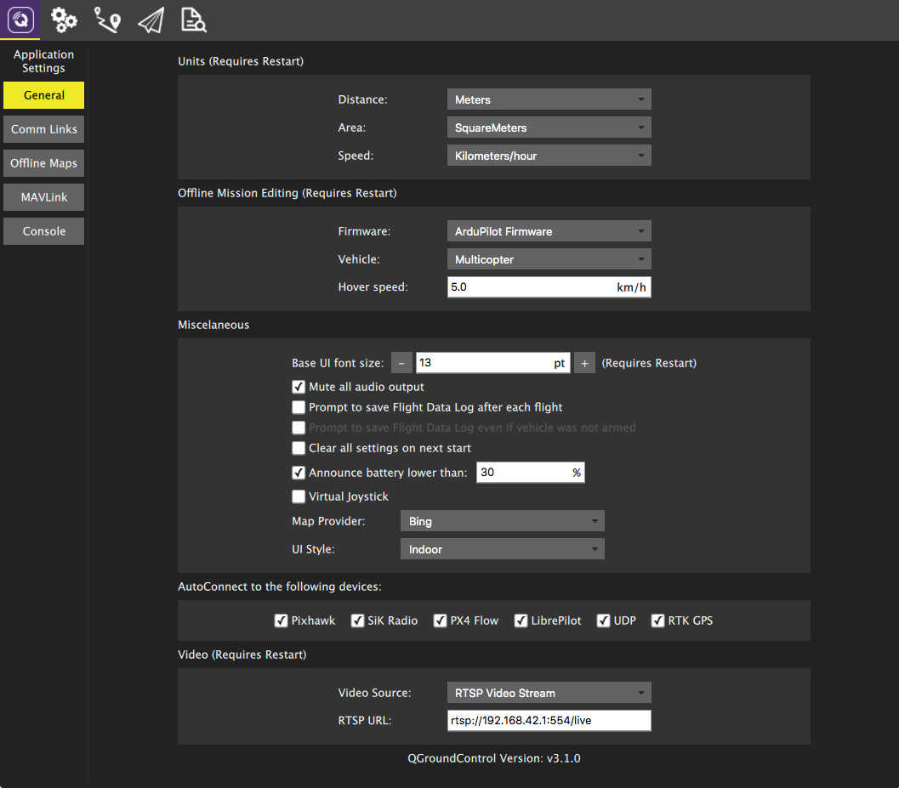

# Settings View

The Settings View allows you to configure the settings which are associated with the QGroundControl application. Since these settings are for QGroundControl and not your specific vehicle you do not have to have a vehicle connected to change these settings.

You can switch between the various settings options by clicking the buttons on the left.

## Settings Options

**General**
 The main application settings.

**Comm Links**
 Allows you to manually create communication links and connect to them. *Keep in mind that normally this is not needed since QGroundControl will automatically connect to the most common devices.*

**[Offline Maps](OfflineMaps.md)**
 Allows you to cache maps for use while you have no internet connection.

**Mavlink**
 Settings associated with the MAVLink connection to a vehicle.

**Console**
 Used to capture application [logs](../Support/Support.md) for help with diagnosing application problems.