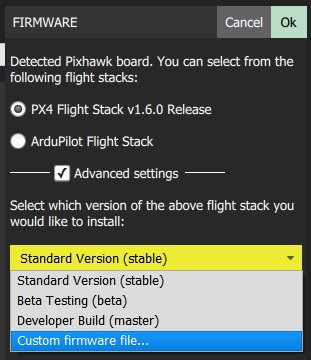

# Loading firmware

QGroundControl을 사용하면 최신 버전을 선택해서 설치할 수 있습니다. QGroundControl은 Pixhawk계열, SiK 라디오, PX4 Flow 장치 등에 펌웨어를 로딩할 수 있습니다.

## 펌웨어를 설치하기 전에 [주의할 점]

펌웨어를 비행체로 설치하기 전에, 모든 USB연결이나 텔레메트리 라디오 연결이 해제되어 있어야 합니다. 또한 비행체는 배터리로 전원을 공급받으면 안됩니다.

## USB로 장치에 연결하기

이제 여러분의 장치(Pixhawk, SiK Radio, PX4 Flow)를 직접 USB로 컴퓨터에 연결합니다. USB hub를 사용하지 않습니다. USB 포트에 직접 연결하도록 합니다.

## 로드할 펌웨어 선택하기

일단 장치가 연결되면, 어떤 펌웨어를 로드할지 선택할 수 있습니다. 위에 이미지는 펌웨어를 Pixhawk계열 보드로 업로드합니다. [PX4 Pro](http://px4.io/)와 [ArduPilot](http://ardupilot.com) 펌웨어 중에 선택합니다.

“Advanced mode” 체크박스를 체크하면 로컬 파일에 있는 펌웨어나 개발자버전의 펌웨어를 선택할 수 있습니다.

## 펌웨어 로드 완료

일단 지정한 펌웨어가 로딩을 완료하면, 장치는 리부팅하고 다시 연결됩니다.

> **Note** 현재 타블릿이나 핸드폰 버전에서는 펌웨어 로딩을 지원하지 않습니다.*
