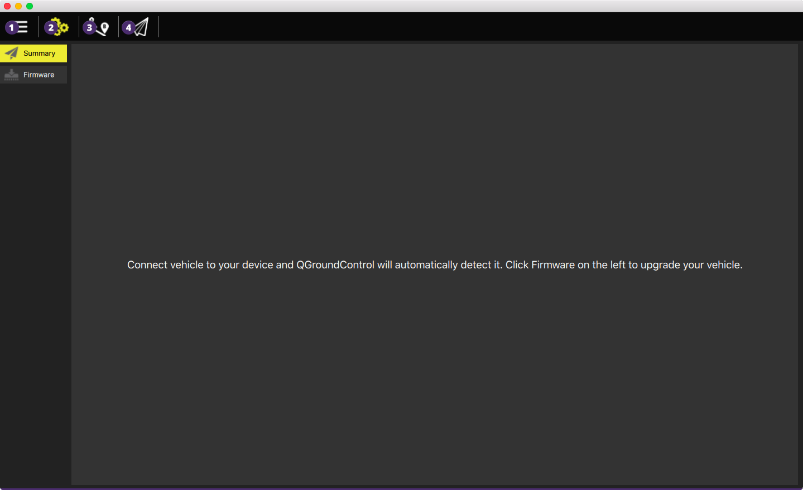

# This is QGroundControl
The first step is to download and install it. On its first screen you can access the main functionalities, like setup your drone, plan and monitor your flight.
 
 

 **Application Settings**
 uhsfghldjkglhzdjkhgjkhlzdgjkdjkrgkjdfgjklzdgjkjkdfgj

 **Setup**
 Configure and tune your vehicle

 **Autonomous Flight**
 Create autonomous missions

 **Flight monitoring**
 View vehicle position on the map as well as instrument indicators. Also switch between the Map and streaming Video view