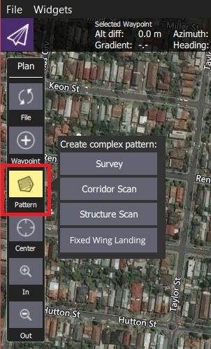

# Шаблоны

The *Pattern tools* (in the [PlanView](../PlanView/PlanView.md) *Plan Tools*) allow you to specify complex flight patterns using a simple graphical UI. The available pattern tools depend on the vehicle (and support for the vehicle-type in the flight stack).

| Паттерн                                                            | Описание                                                                                                                                                                                       | Тип                |
| ------------------------------------------------------------------ | ---------------------------------------------------------------------------------------------------------------------------------------------------------------------------------------------- | ------------------ |
| [Survey](../PlanView/pattern_survey.md)                            | Create a grid flight pattern over a polygonal area.   
You can specify the polygon as well as the specifications for the grid and camera settings appropriate for creating geotagged images.   | Все                |
| [Сканирование структуры](../PlanView/pattern_structure_scan_v2.md) | Create a grid flight pattern that captures images over vertical surfaces (polygonal or circular).   
Обычно используются для визуального осмотра конструкций или создания 3D-моделей структур. | Мультикоптер, VTOL |
| [Корридор](../PlanView/pattern_corridor_scan.md)                   | Создайте шаблон полета, который следует за полилинией (например, для осмотра дороги).                                                                                                          | Все                |
| [Fixed Wing Landing](../PlanView/pattern_fixed_wing_landing.md)    | Добавить приземление самолета в миссию.                                                                                                                                                        | Самолет            |