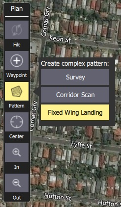

# Fixed Wing Landing Pattern (Plan Pattern)

The *Fixed Wing Landing Pattern* tool allows you to add a fixed wing landing pattern to a mission. It is supported on both ArduPilot and PX4.

The first point of the pattern is a loiter point with a specific altitude and the second is a landing point. The vehicle will loiter at the first point until it reaches the target altitude, and then begin the landing sequence to fly down to the specified landing spot.

Both the loiter and land points can be dragged to new positions, and a number of other settings can be configured in the associated mission item.

## Creating a Landing Pattern

To create a landing pattern:

1. Open [PlanView](../PlanView/PlanView.md) *Plan Tools*.
2. Choose the *Pattern Tool* from the *Plan Tools* and then select *Fixed Wing Landing Pattern*.
  
  
  
  This will add a *Landing Pattern* item to the mission list (on the right).
  
  

3. Click on the map to create both the loiter point and the landing point. These can be moved on the map.

Additional settings are covered in the next section.

## Settings

The landing pattern can be further configured in the associated mission item (in the mission item list on the right hand side of the Plan View).

### Loiter Point

The *Loiter Point* settings are used to configure the loiter altitude, radius and direction.

The configurable options are:

- **Altitude** - Loiter altitude.
- **Radius** - Loiter radius.
- **Loiter clockwise** - Check to loiter in a clockwise direction (anti-clockwise is the default). 

### Landing Point

The *Landing Point* settings are used to configure the landing position and path.

The configurable options are:

- **Heading** - Heading from loiter point to land point.
- **Altitude** - Altitude for landing point (nominally zero).
- *Radio Buttons* 
  - **Landing Dist** - Distance between loiter point and landing point.
  - **Glide Slope** - Glide slope between loiter point and landing point.
- **Altitudes relative to home** - Check to set all altitudes in mission item to be relative to home (default is AMSL).

## Implementation

This pattern creates three mission items:

- `DO_LAND_START` - If you abort a landing it sends `DO_GO_AROUND` to the vehicle, which then causes the mission to return to this point and try to land again.
- `NAV_LOITER_TO_ALT` - Start point for landing
- `NAV_LAND` - End point for landing

The vehicle flares to landing using a flight path generated by the firmware between the `NAV_LOITER_TO_ALT` point and the `NAV_LAND` point.

If those two locations violate the vehicle's flare constraints (e.g. descent angle is too steep) an error will be raised after you upload the invalid mission to the vehicle.

> **Note** On PX4, violating the flare constraints sends an error message to the ground station at upload time, and the autopilot will refuse to start the mission (since it fails integrity checks).