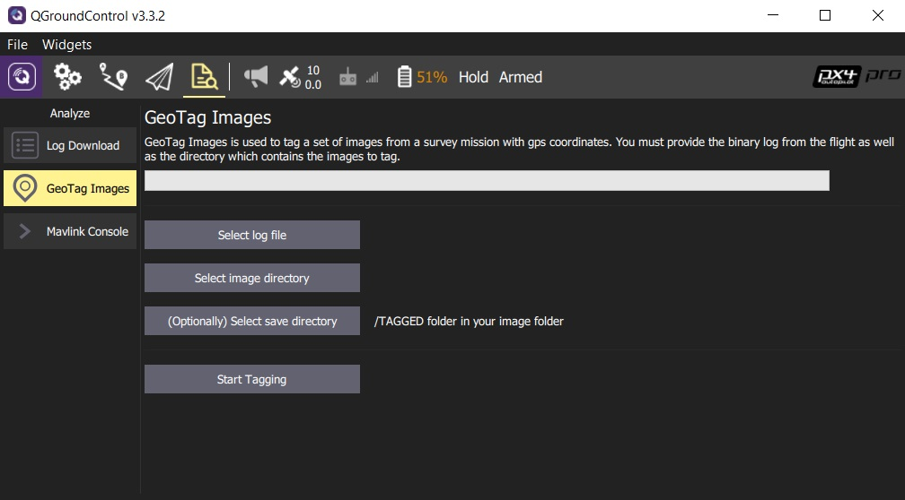

# GeoTag Images (Analyze View)

The *GeoTag Images* screen (**Analyze > GeoTag Images**) allows you to geotag images from a survey mission using information in the flight log.

> **Примечание** Эта функция работает только с журналами стека полета *PX4*. ArduPilot не поддерживается.

Select the log file, image directory and (optionally) output directory for geotagged images using the buttons provided. Click **Start Tagging** to generate the geotagged images.