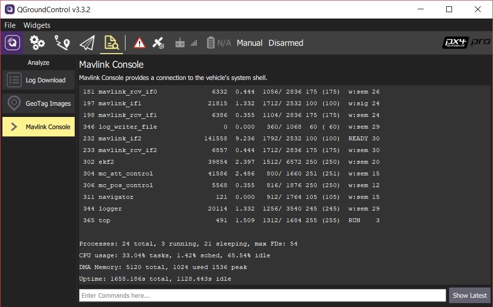

# Консоль MAVLink (Экран Анализа)

The MAVLink Console (**Analyze > Mavlink Console**) allows you to connect to the PX4 [System Console](https://docs.px4.io/main/en/debug/system_console.html) and send commands.

> **Примечание** консоль работает только при подключении к *оборудованию* полетного контроллера *PX4*. PX4 SITL и ArduPilot не поддерживаются.

> **Совет** Это очень полезная функция для разработчиков, так как она предоставляет глубокий доступ к системе. В частности, если вы подключены через Wifi, вы можете иметь такой же уровень доступа во время полета БПЛА.

The view does not display any output except in response to commands. Once the vehicle is connected, you can enter commands in the bar provided (for a full list of available commands enter: `?`).

Command output is displayed in the view above the command bar. Click **Show Latest** to jump to the bottom of the command output.