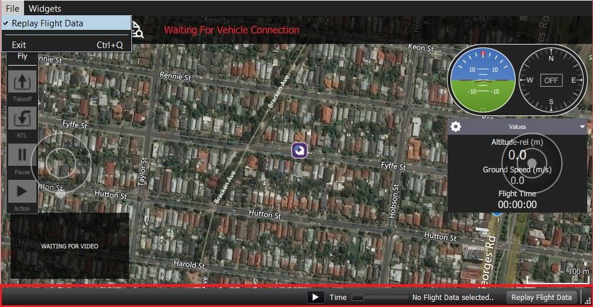

# Повтор данных полета

> **Предупреждение** Эта функция предназначена главным образом для **разработчиков**. It is only supported on desktop builds (Windows, Linux, Mac OS).

The *Replay Flight Data* features allows users to replay a telemetry log, enabling review of past or problematic flights. The flight can be started, paused, stopped, restarted etc.

> **Note** *QGroundControl* treats flight replay like an active connection. When you pause/stop playing, the ground station will report "Communication Lost" and wait for disconnection or for more messages.

Для повтора данных полета:

1. Отключить любые активные соединения.
2. Выберите **Файл | Повтор данных полета**, чтобы включить видимость строки повтора полета.
    
    

3. Выберите кнопку **Повторить данные полета** в панели для отображения диалога выбора файла **. Выберите файл журнала для повтора из доступных журналов телеметрии.
    
    
    
    *QGroundControl* начнет воспроизведение сообщений из лог-файла.

4. Используйте кнопку **pause/reset** для управления воспроизведением. При паузе можно переместить ползунок в новую позицию в журнале.

5. Для прекращения воспроизведения лог-файла необходимо выбрать **Отключить**. На данном этапе вы можете выбрать другой лог-файл для воспроизведения.

> **Совет** Вы можете более подробно проверить запущенное повтор, используя мастер [MAVLink Инспектор](../app_menu/mavlink_inspector.md) или [MAVLink Analyzer (Analyze)](../app_menu/mavlink_analyzer.md).