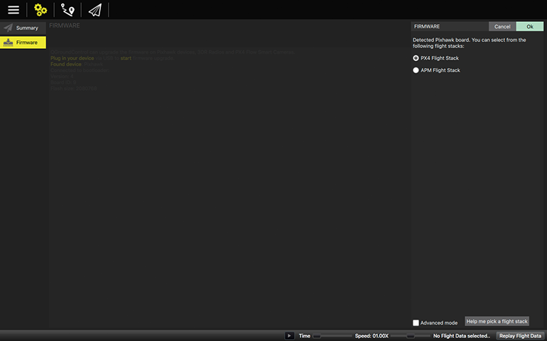
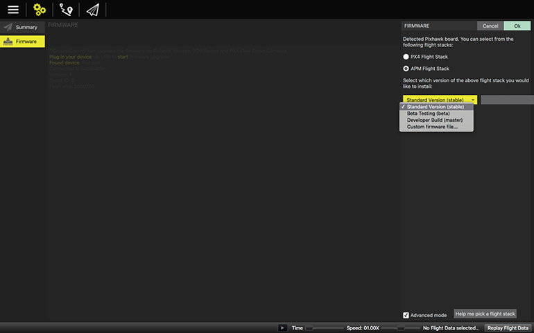
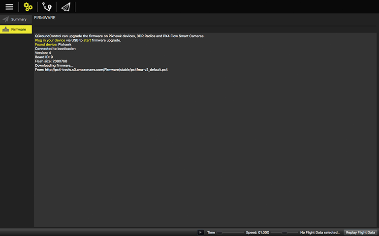

# Loading firmware
Firmware is what makes your vehicle run and have all of its great capabilities. Using QGroundControl you can install the latest versions of the firmware of your choice.

Before you can install firmware onto your vehicle all USB connections to you vehicle, either direct or through a telemetry radio must be disconnected. Also the vehicle must not be powered by battery. Firmware Upgrade is found in the Setup View, then click the Firmware button .
  

 
Now connect your vehicle’s Pixhawk board directly to your computer with a USB. Do not connect the vehicle through a USB hub. Only connect it directly to a powered USB port on your machine.

You can now choose between the two different firmware version, referred to as a “Flight Stack”. If you are using ArduCopter/ArduPlane/ArduRover firmware from ardupilot.com choose the “APM Flight Stack”. If you are using the PX4 firmware from px4.io choose “PX4 Flight Stack”.
  

 
Selecting the “Advanced mode” check box allows you to choose from developer releases of the firmware as well as install firmware from your local file system.
  

 
Once you have made your selections, click Ok. Firmware upgrade will now begin.
  

 
Once firmware upgrade is complete you Vehicle should be automatically connected to QGroundControl. 
   
*Note: Support for loading Firmware is currently not available on tablet versions of QGroundControl.*
