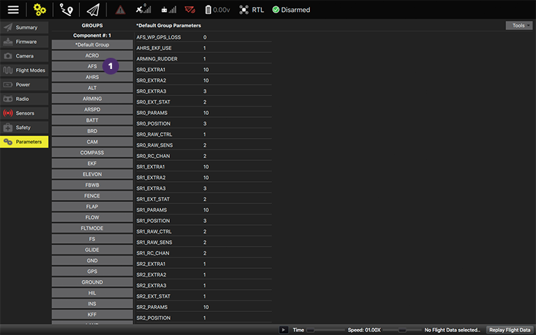
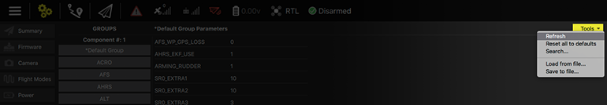

# Parameters
On the setup tab you will see the default parameters already listed when you access that. Click on any other group to see the respective parameter list [1] or on any parameter to change it or on.
  

Clicking on the parameter will open a context menu to edit, along with a more detailed description.
  

  
### Tools
 

**Refresh**
 Description of the function.

**Reset all to defaults**
 Turn all parameters to default values.

**Search**
 Search for an specific parameter or just list the parameters in an alphabetical order in a unique list by leaving the text field blank and clicking apply .

**Load from file / Save to file**
 Load parameters from an existing file or export the configuration you did to a file to be used in another software.
