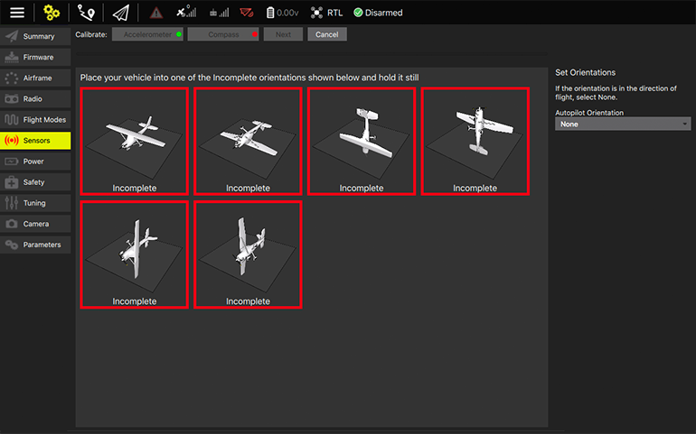

# Sensors
On the Sensors tab  you will see and configure all the sensors the vehicle has inside . Accelerometer, Airspeed, Compass, Gyroscope and Level Horizon are some examples.

Sensors marked with red means that something is wrong, while marked in green means that is working properly.

To start the individual calibration steps, you can click on each sensor's button.
 
 
###Compass

Clicking on the sensor's button will open a context menu to calibrate, along with a more detailed settings .

Before start the calibration steps, you can set the autopilot or compass orientations , if you want/need.

Clicking on OK button you start the process.

A serie of images will appear on screen. You need to place and turn the vehicle into the orientations, step by step, according to the instructions. 

Boxes marked in red means that the step is not completed.

So, when you place the vehicle according to the image, the respective box changes to yellow, indicating that you need to rotate it continuously until marked as Completed.

