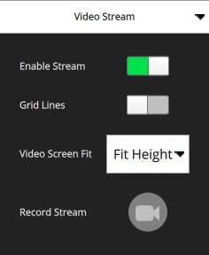
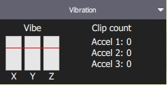
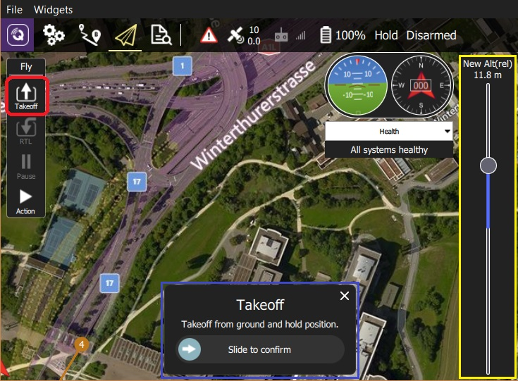
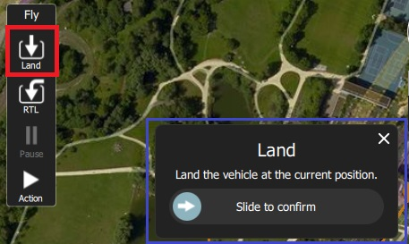

# Uçuş Ekranı

Uçuş Ekranı, aracı uçarken izlemek ve araca komut vermek için kullanılır.

Şunları yapmak için kullanabilirsiniz:

- Otomatik şekilde [pre-flight checklist](#preflight_checklist) çalıştırın.
- Görevleri kontrol edin: [start](#start_mission), [continue](#continue_mission), [pause](#pause), ve [resume](#resume_mission).
- Aracı [arm](#arm)/[disarm](#disarm)/[emergency stop](#emergency_stop), [takeoff](#takeoff)/[land](#land), [change altitude](#change_altitude), belirli bir konuma [go to](#goto) veya [orbit](#orbit), ve [return/RTL](#rtl) için yönlendirin.
- Harita görünümü ile video görünümü (eğer varsa) arasında geçiş yapın
- Mevcut araç için video, görev, telemetri ve diğer bilgileri görüntüleyin ve ayrıca bağlı araçlar arasında geçiş yapın.

## Kullanıcı Arayüzü'ne Genel Bakış

Yukarıdaki ekran görüntüsü, uçuş ekranının ana öğelerini gösterir:

- **Harita:** Bağlı tüm araçların pozisyonlarını ve mevcut aracın görevini gösterir. 
  - Haritada gezinmek için haritayı sürükleyebilirsiniz (harita belirli bir süre sonra otomatik olarak yeniden ortalanır).
  - Kalkıştan sonra, haritaya tıklayarak bir konuma [Go to](#goto) veya [Orbit at](#orbit) ayarlayabilirsiniz.
- **Uçuş Araç Çubuğu:** Sensörler (GPS, pil, RC kontrolü) ve araç durumu (Uçuş modu, Etkin (armed) / Devre Dışı (disarmed) durumu) hakkında anahtar bilgiler. 
  - Daha fazla ayrıntı görmek için sensör göstergelerini seçin.
  - Yeni bir mod seçmek için * Flight mode * metnine (ör. "Hold") tıklayın. Tüm modlar mevcut olmayabilir.
  - Aracın uçuşa hazır olma durumunu değiştirmek için *Armed/Disarmed* metnine tıklayın. Eğer araç uçuyorsa *Emergency Stop* için bu metne tıklayın.
- **Uçuş araçları:** Şunları yapmak için kullanabilirsiniz: 
  - Kalkış/iniş arasında geçiş yapın.
  - Mevcut işlemi durdur/tekrar başlat (ör. iniş, ya da görev).
  - Güvenli geri dönüş (RTL ya da Return olarakta bilinir).
  - *Action* butonu mevcut durum için diğer uygun seçenekleri sunar (bunlar *Confirmation Slider*'ın üstünde gözükür). İşlemler, yüksekliği değiştirmeyi veya bir göreve devam etmeyi içerir.
  - [preflight checklist](#preflight_checklist)'i etkinleştirin (varsayılan olarak devre dışıdır).
- **[Bilgi Paneli](#instrument_panel):** Telemetri, kamera, video, sistem durumu ve titreşim dahil olmak üzere araç bilgilerini görüntüleyebileceğiniz çok sekmeli widget.
- **[Video/Harita](#video_switcher):** Bir pencerede video ile harita arasında geçiş yapın. 
  - *Video* ya da *Map*'i ön plana almak için öne almak istediğinize tıklayın.
  - *QGroundControl*, aracınızın UDP bağlantısı üzerinden RTP ve RTSP video yayını yapmanızı destekler. Ayrıca direkt bağlantılı UVC cihazları da destekler. QGC'nin video desteği hakkında daha ayrıntılı bilgiyi [Video README](https://github.com/mavlink/qgroundcontrol/blob/master/src/VideoStreaming/README.md)'de bulabilirsiniz.
  - Bir [Telemetry Overlay](../FlyView/VideoOverlay.md) dosyası otomatik olarak oluşturulacaktır
- **Kaydırmalı Onay Butonu:** İstenen işlemi gerçekleştirmek için onay butonu. Operasyonu başlatmak için kaydırın. İptal etmek için **X** 'e basın.

Ayrıca varsayılan olarak görüntülenmeyen/ belirli koşullarda görüntülenebilen bazı öğelerde var. Mesela, çoklu-araç seçici sadece birden çok aracınız varsa veya uçuş öncesi kontrol listesi eğer etkinleştirilmişse görüntülenir.

## Bilgi Paneli {#instrument_panel}

Bilgi Paneli, telemetri, kamera, video, sistem durumu ve titreşim bilgileri dahil olmak üzere mevcut araç hakkında bilgileri görüntüleyebileceğiniz çok sekmeli bir widgettır.

Varsayılan şekilde araç telemetrisini gösterir - diğer seçenekleri seçmek için sağdaki açılır menüyü kullanabilirsiniz.

### Değerler (Telemetri)

Değerler sayfası telemetri bilgilerini gösterir; varsayılan olarak rakım (ev konumuna göre) ve yer hızı.

Panelin sol üst köşesindeki küçük dişli simgesine basarak hangi bilgilerin görüntüleneceğini ayarlayabilirsiniz. Her değeri ister normal isterse "büyük" boyutta görüntülenebilir (normal boyutta sayfadaki her satırda 2 değer varken, büyük boyutta sadece 1 değer olur).

### Kamera {#camera_instrument_page}

Kamera sayfası, kamerayı ayarlamak ve kontrol etmek için kullanılır. Uçuş kontrolcüsüne direkt bağlı bir kamera için sadece kamerayı başlatma ayarı vardır:

[MAVLink Camera Protocol](https://mavlink.io/en/services/camera.html)'ü destekleyen bir kameraya bağlandığınızda ek olarak geçerli hale gelen diğer kamera özelliklerini ayarlayıp kullanabilirsiniz. Örnek olarak, eğer kameranız video modunu destekliyorsa, fotoğraf ve video modları arasında geçiş yapabilir, kaydı başlatıp/durdurabilirsiniz.

Gelişmiş ayarlara sayfanın sol üstündeki dişliye tıklayarak ulaşabilirsiniz.

> **Note** Gösterilen ayarların çoğu kameraya bağlıdır (ayarlar [MAVLink Camera Definition File](https://mavlink.io/en/services/camera_def.html)'da tanımlanmıştır). Sondaki bir kaç ortak ayar sabit olarak kodlanmıştır: Fotoğraf Modu (Tekli/Photolapse), Fotoğraf Aralığı (Timelapse için), Kamera Ayarlarını Varsayılana Sıfırla (kameraya bir sıfırlama komutu gönderir), Format (depolama)

### Video Akışı {#video_instrument_page}

Video sayfası video akışını etkinleştirmek ve devre dışı bırakmak için kullanılır. Etkinleştirildiğinde, video akışını durdurup başlatabilir, ızgara çizgilerini açabilir, görüntünün ekrana nasıl sığacağını değiştirebilir ve videoyu yerel olarak QGC ile kaydedebilirsiniz.

### Durum

Durum sayfası aracınızdaki sistemin durumunu gösterir. Eğer sistemde bir sıkıntı olursa *QGroundControl* bu sayfayı otomatik olarak açacaktır.

 

### Titreşim

Titreşim sayfası mevcut titreşim seviyelerini ve klips sayılarını gösterir.

## İşlemler/Görevler

Aşağıdaki bölümler, Uçuş Ekranı'nda genel işlemlerin / görevlerin nasıl gerçekleştirileceğini açıklamaktadır.

> **Note** Mevcut seçeneklerin çoğu, hem aracın türüne hem de mevcut durumuna bağlıdır.

### Uçuş Öncesi Kontrol Listesi {#preflight_checklist}

Aracın doğru ayarlandığını ve uçmak için güvenli olduğu gösteren standart kontrollerin yapılması için otomatik bir uçuş öncesi kontrol listesi kullanılabilir.

Kontrol listesi için, önce [Application Settings > General > Fly View](../SettingsView/General.md) 'a gidip **Use preflight checklist** onay kutusunu seçerek etkinleştirin. Liste *Flight Tools*'a eklenecektir. Kontrol listesini oradan açabilirsiniz:

Tüm testleri gerçekleştirdikten sonra, tamamlandı olarak işaretlemek için kullanıcı arayüzünde testi seçin.

### Aracı Devreye Alma {#arm}

> **Tip** Genel olarak * QGroundControl * aracı manuel olarak devreye almanızı gerektirmez; Bir göreve veya kalkışa başlarsanız bu sizin için yapılır.

Bir aracı devreye almak, kalkışa hazırlık için motorları çalıştırır.

Aracı devreye almak için, *Fly Toolbar*'dan **Disarmed**'ı seçin ve kaydırmalı onay butonuyla onaylayın.

> **Note** Eğer bir kaç saniye içinde kalkmazlarsa araçlar genellikle otomatik olarak kendilerini devre dışı bırakırlar.

### Aracı Devre Dışı Bırakma {#disarm}

Aracı devre dışı bırakmak motorları durdurur (aracı güvenli hale getirir). Aracı devre dışı bırakmak için araç **landed** halindeyken *Fly Toolbar* 'dan **Armed**'ı seçin.

> **Note** Aracı uçarken devre dışı bırakmak [Emergency Stop](#emergency_stop) olarak adlandırılır

### Acil Durdurma {#emergency_stop}

Acil durdurma, uçarken aracı durdurmakla aynı etkiye sahiptir. Aracınız çarpacaktır/çakılacaktır!

Aracı devre dışı bırakmak için uçuş sırasında *Fly Toolbar*'dan **Armed**'ı seçin.

### Kalkış {#takeoff}

> **Tip** Eğer bir multikopter için göreve başlıyorsanız, *QGroundControl* kalkışı otomatik olarak yapacaktır.

Kalkmak için (iniş yapıldığında):

1. *Fly Tools*'dan **Takeoff** butonuna basın (kalkıştan sonra bu buton **Land** butonu olarak değişecektir).
2. İsterseniz kalkış yüksekliğini sağda bulunan dikey kaydırıcıyla ayarlayabilirsiniz.
3. Kaydırmalı onay butonunu kaydırarak kalkışı onaylayın.

### İniş {#land}

Uçuş sırasında istediğiniz zaman mevcut konuma inebilirsiniz:

1. Press the **Land** button in the *Fly Tools* (this will toggle to a **Takeoff** button when landed).
2. Kaydırmalı onay butonunu kaydırarak inişi onaylayın.

### RTL/Geri Dönüş

Uçuş esnasında istediğiniz zaman ana konuma geri dönün:

1. *Fly Tools*'dan **RTL** butonuna basın.
2. Kaydırmalı onay butonunu kaydırarak RTL'i onaylayın.

> **Note** Araç, türüne ve konfigürasyonuna bağlı olarak ana konuma inedebilir.

### Yükleklik Değiştirme {#change_altitude}

Uçuş esnasında eğer bir görevde değilse aracın yükseliği değiştirilebilir:

1. *Fly Tools*'dan **Action** butonuna basın
2. İletişim kutusundan *Change Altitude*'ı seçin.
  
  

3. Dikey kaydırıcıyla istenilen yüksekliği ayarlayın, ardından kaydırmalı onay butonu ile onaylayın.
  
  

### Hedef Konum {#goto}

Kalkıştan sonra belirli bir konuma uçmayı ayarlayabilirsiniz.

1. Haritada aracın gitmesini istediğiniz yere basın ve açılır pencereden **Go to location**'ı seçin.
  
  

2. Konum harita üzerinde kaydırmalı onay butonuyla birlikte gözükecektir.
  
  

3. Hazır olduğunuzda kaydırarak onay verin (ya da **X**'e basarak iptal edin).

> **Note** Hedef konum aracın 1 km çevresinde seçilmelidir (QGC'de sabit olarak ayarlanmıştır).

### Yörünge Konumu {#orbit}

Kalkıştan sonra belirli bir konumun çevresinde yörüngede dolaşmasını ayarlayabilirsiniz.

1. Haritaya basın (istediğiniz yörüngenin merkezine yakın bir yere) ve açılır pencereden **Orbit at location**'i seçin.
  
  

2. Önerile yörünge kaydırmalı onay butonu ile harita üzerinde belirecektir.
  
  
  
  - Yörüngenin konumunu değiştirmek için merkezini seçin ve kaydırın.
  - Yörüngenin yarıçapını, çemberin dışındaki noktayı seçip sürükleyerek ayarlayabilirsiniz.
3. Hazır olduğunuzda kaydırarak onay verin (ya da **X**'e basarak iptal edin).

### Duraklatma

Kalkış, iniş, RTL, Yörünge dahil olmak üzere çoğu operasyonu aracın olduğu konumda duraklatabilirsiniz. Duraklatıldığında aracın davranışı aracın tipine bağlıdır, genellikle multikopterler havada asılı kalırken sabit kanatlar çember çizer.

> **Note** Bir *Goto location* operasyonunu durduramazsınız.

Durdurmak için:

1. *Fly Tools*'dan **Pause** butonuna basın.
2. İsterseniz yeni bir yüksekliği sağda bulunan dikey kaydırıcıyla ayarlayabilirsiniz.
3. Kaydırmalı onay butonunu kaydırarak durdurmayı onaylayın.

### Görevler

#### Görevi Başlatma {#start_mission}

Araç inmiş durumdayken bir görevi başlatabilirsiniz (görevi başlatma onay kaydıracı varsayılan olarak çoğu kez gösterilir).

Yerdeki bir aracın görevini başlatmak için:

1. *Fly Tools*'dan **Action** butonuna basın
2. İletişim kutusundan *Start Mission*'ı seçin.
  
  
  
      (kaydırmalı onay çubuğunu görüntülemek için)
      

3. Onay kaydıracı belirdiğinde görevi başlatmak için kaydırın.
  
  

#### Göreve Devam Etme (Continue Mission) {#continue_mission}

Göreve *sıradaki* hedef noktanızdan *devam* edebilirsiniz (*Continue Mission* kaydırmalı onay butonu kalkıştan sonra çoğu kez varsayılan olarak gösterilir).

> **Note** Continue ve [Resume mission](#resume_mission) farklıdır! Continue komutu durdurulmuş bir görevi tekrar başlatmak veya zaten kalkmış bir araç için yani kalkış görevi komutunu kaçırmış durumdaysanız kullanılır. Resume ise eğer görevin ortasında RTL ya da iniş yaptığınızda (ör. batarya değiştirmek için) ve sonrasında göreve devam etmek istiyorsanız kullanılır (yani görevi olduğunuz yerden devam ettirmek yerine, görevdeki bir sonraki hedefinizden devam ettirir).

Görevinize aşağıdakileri yaparak devam edebilirsiniz (hali hazırda bir görevde değilseniz!):

1. *Fly Tools*'dan **Action** butonuna basın
2. İletişim kutusundan *Continue Mission*'ı seçin.
  
  

3. Kaydırmalı onay butonunu kaydırarak göreve devam edin.
  
  

#### Göreve Devam Etme (Resume Mission) {#resume_mission}

*Resume Mission*, bir görevin içinde [RTL/Return](#rtl) ya da [Land](#land) gerçekleştirdikten sonra (ör. batarya değiştirmek için) kullanılır.

> **Note** Eğer bataryayı değiştiricekseniz, bataryanın bağlantısını kestikten sonra QGC ile aracın bağlantısını **kesmeyin**. Yeni bataryayı yerleştirdikten sonra *QGroundControl* cihazı tekrar tespit edip, bağlantıyı otomatik olarak yeniden kuracaktır.

İnişten sonra size görev planını cihazdan kaldırma, cihazda bırakma ya da göreve kaldığı yerden devam etme seçeneklerini sunan bir *Flight Plan complete* iletişim kutusu karşınıza çıkacaktır.

Eğer göreve devam etmeyi düşünüyorsanız, *QGroundControl* görevi yapılandırıp araca yükleyecektir. Ardından *Start Mission* kaydıracıyla göreve devam edebilirsiniz.

Aşağıdaki görüntü inişten sonra yeniden yapılandırılan bir görevi göstermektedir.

> **Note** Bir görev, basit bir şekilde aracın son gerçekleştirdiği görev aşamasından devam edemez, çünkü son yapılan aşamada görevin sonraki aşamalarına etki edebilecek birden fazla etken olabilir (ör. hız komutları ya da kameranın kontrol komutları). Basit bir şekilde devam etmek yerine, *QGroundControl* son gerçekleştirilen görev aşamasından başlayarak, ilgili komutları da dikkate alarak görevi tekrar yapılandırır.

#### İnişten Sonra Görevi Kaldırma {#resume_mission_prompt}

Görev bittikten sonra aracın inişi ve devre dışı bırakılmasının ardından görevi araçtan kaldırmanız istenecektir. Bunun amacı farkında olmadan araçta bırakılan görevlerin potansiyel olarak beklenmeyen davranışlar sergilemesinin önüne geçmektir.

### Videoyu Görüntüleme {#video_switcher}

Video akışı etkinleştirildiğinde, *QGroundControl* haritanın sol altında bulunan "videoya geçiş penceresi"nde videoyu göstermeye başlıyacaktır. Ön planda *Video* ya da *Map* hangisini görüntülemek istiyorsanız geçiş penceresinde istediğiniz yere tıklayabilirsiniz (aşağıda videonun ön planda olduğu hali görebilirsiniz).

> **Note** video akışı [Application Settings > General tab > Video](../SettingsView/General.md#video)'dan etkinleştirilebilir/düzenlenebilir.

You can further configure video display using controls on the switcher:

    
    

- Resize the switcher by dragging the icon in the to right corner.
- Hide the switcher by pressing the toggle icon in the lower left.
- Detach the video switcher window by pressing on the icon in its top left corner (once detached, you can move and resize the window just like any other in your OS). If you close the detached window the switcher will re-lock to the QGC Fly view.

### Record Video

If supported by the camera and vehicle, *QGroundControl* can start and stop video recording on the camera itself. *QGroundControl* can also record the video stream and save it locally.

> **Tip** Video stored on the camera may be of much higher quality, but it is likely that your ground station will have a much larger recording capacity.

#### Record Video Stream (on GCS)

Video stream recording is controlled on the [video stream instrument page](#video_instrument_page). Press the red circle to start recording a new video (a new video file is created each time the circle is pressed); the circle will change into a red square while recording is in progress.

Video stream recording is configured in the [Application Settings > General tab](../SettingsView/General.md):

- [Video Recording](../SettingsView/General.md#video-recording) - specifies the recording file format and storage limits. > **Note** Videos are saved in Matroska format (.mkv) by default. This format is relatively robust against corruption in case of errors.
- [Miscellaneous](../SettingsView/General.md#miscellaneous) - Streamed video is saved under the **Application Load/Save Path**. 

> **Tip** The stored video includes just the video stream itself. To record video with QGroundControl application elements displayed, you should use separate screen recording software.

#### Record Video on Camera

Start/stop video recording *on the camera itself* using the [camera instrument page](#camera_instrument_page). First toggle to video mode, then select the red button to start recording.

