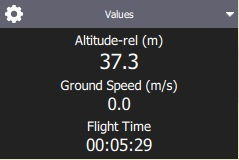
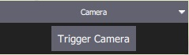
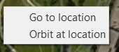
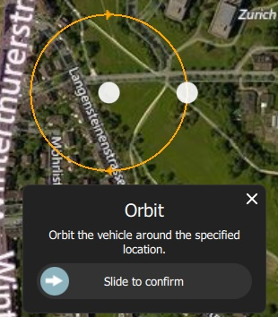
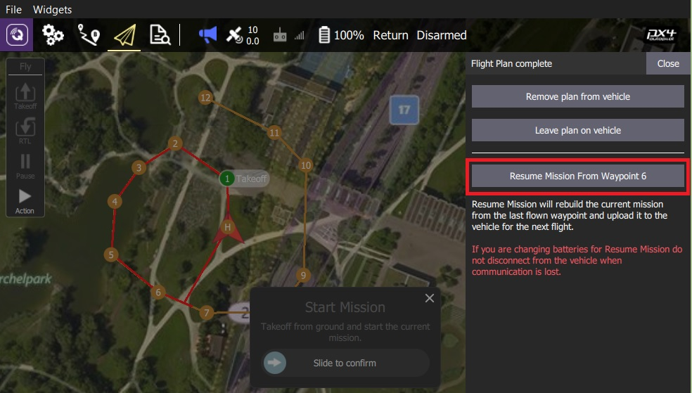

# Uçuş Ekranı

Uçuş Ekranı, aracı uçarken izlemek ve araca komut vermek için kullanılır.

Şunları yapmak için kullanabilirsiniz:

- Otomatik şekilde [pre-flight checklist](#preflight_checklist) çalıştırın.
- Görevleri kontrol edin: [start](#start_mission), [continue](#continue_mission), [pause](#pause), ve [resume](#resume_mission).
- Aracı [arm](#arm)/[disarm](#disarm)/[emergency stop](#emergency_stop), [takeoff](#takeoff)/[land](#land), [change altitude](#change_altitude), belirli bir konuma [go to](#goto) veya [orbit](#orbit), ve [return/RTL](#rtl) için yönlendirin.
- Harita görünümü ile video görünümü (eğer varsa) arasında geçiş yapın
- Mevcut araç için video, görev, telemetri ve diğer bilgileri görüntüleyin ve ayrıca bağlı araçlar arasında geçiş yapın.

## Kullanıcı Arayüzü'ne Genel Bakış

Yukarıdaki ekran görüntüsü, uçuş ekranının ana öğelerini gösterir:

- **Harita:** Bağlı tüm araçların pozisyonlarını ve mevcut aracın görevini gösterir. 
  - Haritada gezinmek için haritayı sürükleyebilirsiniz (harita belirli bir süre sonra otomatik olarak yeniden ortalanır).
  - Kalkıştan sonra, haritaya tıklayarak bir konuma [Go to](#goto) veya [Orbit at](#orbit) ayarlayabilirsiniz.
- **Uçuş Araç Çubuğu:** Sensörler (GPS, pil, RC kontrolü) ve araç durumu (Uçuş modu, Etkin (armed) / Devre Dışı (disarmed) durumu) hakkında anahtar bilgiler. 
  - Daha fazla ayrıntı görmek için sensör göstergelerini seçin.
  - Yeni bir mod seçmek için * Flight mode * metnine (ör. "Hold") tıklayın. Tüm modlar mevcut olmayabilir.
  - Aracın uçuşa hazır olma durumunu değiştirmek için *Armed/Disarmed* metnine tıklayın. Eğer araç uçuyorsa *Emergency Stop* için bu metne tıklayın.
- **Uçuş araçları:** Şunları yapmak için kullanabilirsiniz: 
  - Kalkış/iniş arasında geçiş yapın.
  - Mevcut işlemi durdur/tekrar başlat (ör. iniş, ya da görev).
  - Güvenli geri dönüş (RTL ya da Return olarakta bilinir).
  - *Action* butonu mevcut durum için diğer uygun seçenekleri sunar (bunlar *Confirmation Slider*'ın üstünde gözükür). İşlemler, yüksekliği değiştirmeyi veya bir göreve devam etmeyi içerir.
  - [preflight checklist](#preflight_checklist)'i etkinleştirin (varsayılan olarak devre dışıdır).
- **[Bilgi Paneli](#instrument_panel):** Telemetri, kamera, video, sistem durumu ve titreşim dahil olmak üzere araç bilgilerini görüntüleyebileceğiniz çok sekmeli widget.
- **[Video/Harita](#video_switcher):** Bir pencerede video ile harita arasında geçiş yapın. 
  - *Video* ya da *Map*'i ön plana almak için öne almak istediğinize tıklayın.
  - *QGroundControl*, aracınızın UDP bağlantısı üzerinden RTP ve RTSP video yayını yapmanızı destekler. Ayrıca direkt bağlantılı UVC cihazları da destekler. QGC'nin video desteği hakkında daha ayrıntılı bilgiyi [Video README](https://github.com/mavlink/qgroundcontrol/blob/master/src/VideoStreaming/README.md)'de bulabilirsiniz.
  - Bir [Telemetry Overlay](../FlyView/VideoOverlay.md) dosyası otomatik olarak oluşturulacaktır
- **Kaydırmalı Onay Butonu:** İstenen işlemi gerçekleştirmek için onay butonu. Operasyonu başlatmak için kaydırın. İptal etmek için **X** 'e basın.

Ayrıca varsayılan olarak görüntülenmeyen/ belirli koşullarda görüntülenebilen bazı öğelerde var. Mesela, çoklu-araç seçici sadece birden çok aracınız varsa veya uçuş öncesi kontrol listesi eğer etkinleştirilmişse görüntülenir.

## Bilgi Paneli {#instrument_panel}

Bilgi Paneli, telemetri, kamera, video, sistem durumu ve titreşim bilgileri dahil olmak üzere mevcut araç hakkında bilgileri görüntüleyebileceğiniz çok sekmeli bir widgettır.

Varsayılan şekilde araç telemetrisini gösterir - diğer seçenekleri seçmek için sağdaki açılır menüyü kullanabilirsiniz.

### Değerler (Telemetri)

Değerler sayfası telemetri bilgilerini gösterir; varsayılan olarak rakım (ev konumuna göre) ve yer hızı.

Panelin sol üst köşesindeki küçük dişli simgesine basarak hangi bilgilerin görüntüleneceğini ayarlayabilirsiniz. Her değeri ister normal isterse "büyük" boyutta görüntülenebilir (normal boyutta sayfadaki her satırda 2 değer varken, büyük boyutta sadece 1 değer olur).

### Kamera {#camera_instrument_page}

Kamera sayfası, kamerayı ayarlamak ve kontrol etmek için kullanılır. Uçuş kontrolcüsüne direkt bağlı bir kamera için sadece kamerayı başlatma ayarı vardır:

[MAVLink Camera Protocol](https://mavlink.io/en/services/camera.html)'ü destekleyen bir kameraya bağlandığınızda ek olarak geçerli hale gelen diğer kamera özelliklerini ayarlayıp kullanabilirsiniz. Örnek olarak, eğer kameranız video modunu destekliyorsa, fotoğraf ve video modları arasında geçiş yapabilir, kaydı başlatıp/durdurabilirsiniz.

Gelişmiş ayarlara sayfanın sol üstündeki dişliye tıklayarak ulaşabilirsiniz.

> **Note** Gösterilen ayarların çoğu kameraya bağlıdır (ayarlar [MAVLink Camera Definition File](https://mavlink.io/en/services/camera_def.html)'da tanımlanmıştır). Sondaki bir kaç ortak ayar sabit olarak kodlanmıştır: Fotoğraf Modu (Tekli/Photolapse), Fotoğraf Aralığı (Timelapse için), Kamera Ayarlarını Varsayılana Sıfırla (kameraya bir sıfırlama komutu gönderir), Format (depolama)

### Video Akışı {#video_instrument_page}

Video sayfası video akışını etkinleştirmek ve devre dışı bırakmak için kullanılır. Etkinleştirildiğinde, video akışını durdurup başlatabilir, ızgara çizgilerini açabilir, görüntünün ekrana nasıl sığacağını değiştirebilir ve videoyu yerel olarak QGC ile kaydedebilirsiniz.

### Durum

Durum sayfası aracınızdaki sistemin durumunu gösterir. Eğer sistemde bir sıkıntı olursa *QGroundControl* bu sayfayı otomatik olarak açacaktır.

 

### Titreşim

Titreşim sayfası mevcut titreşim seviyelerini ve klips sayılarını gösterir.

## İşlemler/Görevler

Aşağıdaki bölümler, Uçuş Ekranı'nda genel işlemlerin / görevlerin nasıl gerçekleştirileceğini açıklamaktadır.

> **Note** Mevcut seçeneklerin çoğu, hem aracın türüne hem de mevcut durumuna bağlıdır.

### Uçuş Öncesi Kontrol Listesi {#preflight_checklist}

An automated preflight checklist can be used to run through standard checks that the vehicle is configured correctly and it is safe to fly.

To you the checklist, first enable the tool by navigating to [Application Settings > General > Fly View](../SettingsView/General.md) and selecting the **Use preflight checklist** checkbox. The tool will then be added to the *Flight Tools*. Press it to open the checklist:

Once you have performed each test, select it on it in the UI to mark it as complete.

### Arm {#arm}

> **Tip** Generally *QGroundControl* does not require you to arm the vehicle explicitly; this is done for you if you start a mission or takeoff.

Arming a vehicle starts the motors in preparation for takeoff.

To arm the vehicle, select **Disarmed** in the *Fly Toolbar* and then use the confirmation sider.

> **Note** Vehicles usually disarm automatically if you do not take off after a few seconds.

### Disarm {#disarm}

Disarming the vehicle stops the motors (making the vehicle safe). To disarm the vehicle select **Armed** in the *Fly Toolbar* when the vehicle is **landed**.

> **Note** Disarming the vehicle while it is flying is called an [Emergency Stop](#emergency_stop)

### Emergency Stop {#emergency_stop}

Emergency stop is effectively the same as disarming the vehicle while you are flying. Your vehicle will crash!

To disarm the vehicle select **Armed** in the *Fly Toolbar* when the vehicle is flying.

### Takeoff {#takeoff}

> **Tip** If you are starting a mission for a multicopter *QGroundControl* will automatically perform the takeoff step.

To takeoff (when landed):

1. Press the **Takeoff** button in the *Fly Tools* (this will toggle to a **Land** button after taking off).
2. Optionally set the takeoff altitude in the right-side vertical slider.
3. Confirm takeoff using the slider.

### Land {#land}

You can land at the current position at any time while flying:

1. Press the **Land** button in the *Fly Tools* (this will toggle to a **Land** button when landed).
2. Confirm landing using the slider.

### RTL/Return

Return to the home position at any time while flying:

1. Press the **RTL** button in the *Fly Tools*.
2. Confirm RTL using the slider.

> **Note** The vehicle may also land at the home position, depending on its type and configuration.

### Change Altitude {#change_altitude}

You can change altitude while flying, except when in a mission:

1. Press the **Action** button on the *Fly Tools*
2. Select the *Change Altitude* action from the dialog.
  
  

3. Move the vertical slider to the desired altitude, then drag the confirmation slider to start the action.
  
  

### Goto Location {#goto}

After taking off you can specify that you want to fly to a particular location.

1. Press the map where you want the vehicle to move and select **Go to location** on the popup.
  
  

2. The location will be displayed on the map, along with a confirmation slider.
  
  

3. When you're ready, drag the slider to start the operation (or press the **X** icon to cancel it).

> **Note** Goto points must be set within 1 km of the vehicle (hard-coded in QGC).

### Orbit Location {#orbit}

After taking off you can specify that you want to orbit a particular location.

1. Press on the map (near the centre of your desired orbit) and select **Orbit at location** on the popup.
  
  

2. The proposed orbit will be displayed on the map, along with a confirmation sider.
  
  
  
  - Select and drag the central marker to move the orbit location.
  - Select and drag the dot on the outer circle to change the orbit radius
3. When you're ready, drag the slider to start the operation (or press the **X** icon to cancel it).

### Pause

You can pause most operations, including taking off, landing, RTL, missions, Orbit at location. The vehicle behaviour when paused depends on the vehicle type; typically a multicopter will hover, and a fixed wing vehicle will circle.

> **Note** You cannot pause a *Goto location* operation.

To pause:

1. Press the **Pause** button in the *Fly Tools*.
2. Optionally set a new altitude using the right-side vertical slider.
3. Confirm the pause using the slider.

### Missions

#### Start Mission {#start_mission}

You can start a mission when the vehicle is landed (the start mission confirmation slider is often displayed by default).

To start a mission from landed:

1. Press the **Action** button on the *Fly Tools*
2. Select the *Start Mission* action from the dialog.
  
  
  
      (to display the confirmation slider)
      

3. When the confirmation slider appears, drag it to start the mission.
  
  

#### Continue Mission {#continue_mission}

You can *continue* mission from the *next* waypoint when you're flying (the *Continue Mission* confirmation slider is often displayed by default after you takeoff).

> **Note** Continue and [Resume mission](#resume_mission) are different! Continue is used to restart a mission that has been paused, or where you have taken off, so you've already missed a takeoff mission command. Resume mission is used when you've used a RTL or landed midway through a mission (e.g. for a battery change) and then wish to continue the next mission item (i.e. it takes you to where you were up to in the mission, rather than continuing from you place in the mission).

You can continue the current mission while (unless already in a mission!):

1. Press the **Action** button on the *Fly Tools*
2. Select the *Continue Mission* action from the dialog.
  
  

3. Drag the confirmation slider to continue the mission.
  
  

#### Resume Mission {#resume_mission}

*Resume Mission* is used to resume a mission after performing an [RTL/Return](#rtl) or [Land](#land) from within a mission (in order, for example, to perform a battery change).

> **Note** If you are performing a battery change, **do not** disconnect QGC from the vehicle after disconnecting the battery. After you insert the new battery *QGroundControl* will detect the vehicle again and automatically restore the connection.

After landing you will be prompted with a *Flight Plan complete* dialog, which gives you the option to remove the plan from the vehicle, leave it on the vehicle, or to resume the mission from the last waypoint that was traveled through.

If you select to resume the mission, then *QGroundControl* will rebuild the mission and upload it to the vehicle. Then use the *Start Mission* slider to continue the mission.

The image below shows the mission that was rebuilt after the Return shown above.

> **Note** A mission cannot simply resume from the last mission item that the vehicle executed, because there may be multiple items at the last waypoint that affect the next stage of the mission (e.g. speed commands or camera control commands). Instead *QGroundControl* rebuilds the mission, starting from the last mission item flown, and automatically prepending any relevant commands to the front of the mission.

#### Remove Mission Prompt After Landing {#resume_mission_prompt}

You will be prompted to remove the mission from the vehicle after the mission completes and the vehicle lands and disarms. This is meant to prevent issues where stale missions are unknowingly left on a vehicle, potentially resulting in unexpected behavior.

### Display Video {#video_switcher}

When video streaming is enabled, *QGroundControl* will display the video stream for the currently selected vehicle in the "video switcher window" at the bottom left of the map. You can press the switcher anywhere to toggle *Video* and *Map* to foreground (below we show the video in the foreground).

> **Note** Video streaming is configured/enabled in [Application Settings > General tab > Video](../SettingsView/General.md#video).

You can further configure video display using controls on the switcher:

    
    

- Resize the switcher by dragging the icon in the to right corner.
- Hide the switcher by pressing the toggle icon in the lower left.
- Detach the video switcher window by pressing on the icon in its top left corner (once detached, you can move and resize the window just like any other in your OS). If you close the detached window the switcher will re-lock to the QGC Fly view.

### Record Video

If supported by the camera and vehicle, *QGroundControl* can start and stop video recording on the camera itself. *QGroundControl* can also record the video stream and save it locally.

> **Tip** Video stored on the camera may be of much higher quality, but it is likely that your ground station will have a much larger recording capacity.

#### Record Video Stream (on GCS)

Video stream recording is controlled on the [video stream instrument page](#video_instrument_page). Press the red circle to start recording a new video (a new video file is created each time the circle is pressed); the circle will change into a red square while recording is in progress.

Video stream recording is configured in the [Application Settings > General tab](../SettingsView/General.md):

- [Video Recording](../SettingsView/General.md#video-recording) - specifies the recording file format and storage limits. > **Note** Videos are saved in Matroska format (.mkv) by default. This format is relatively robust against corruption in case of errors.
- [Miscellaneous](../SettingsView/General.md#miscellaneous) - Streamed video is saved under the **Application Load/Save Path**. 

> **Tip** The stored video includes just the video stream itself. To record video with QGroundControl application elements displayed, you should use separate screen recording software.

#### Record Video on Camera

Start/stop video recording *on the camera itself* using the [camera instrument page](#camera_instrument_page). First toggle to video mode, then select the red button to start recording.

