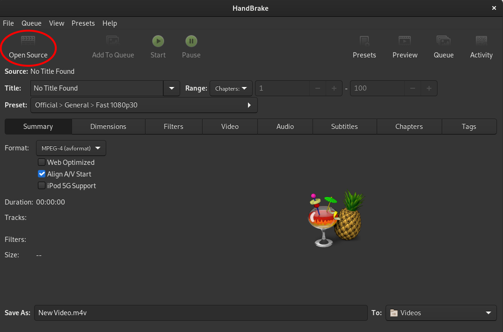
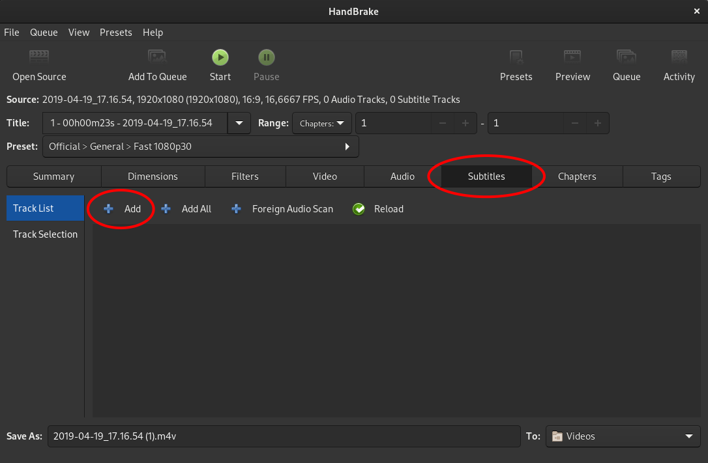
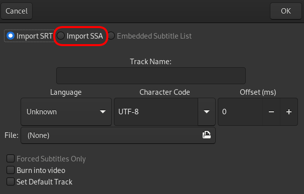
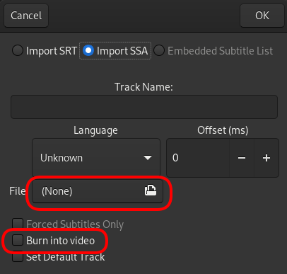
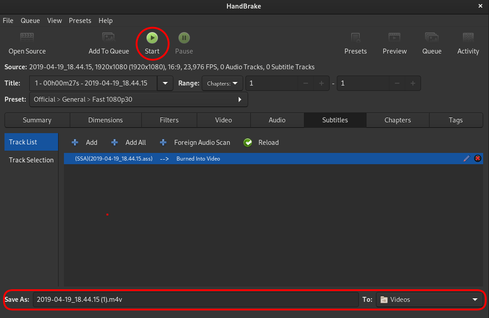

# Video Overlay

QGroundControl bir video akışını dosyaya kaydederken, aynı zamanda oynatma sırasında video üzerinde telemetriyi göstermek için kullanılabilen, telemetri verilerini içeren bir altyazı dosyasını da dışa aktarır. Telemetri [değerleri widget](FlyView.md#values-telemetry)ında gösterilmesi için hangi telemetri değerleri seçilirse seçilsin, onlar da overlaye aktarılacaktır. Overlay değerleri 1Hz hızla güncellenecektir.

Seçilen değerler ekran kullanımını optimize etmek için 3 sütun halinde düzenlenmiştir. 

## Oynatma

Overlay, [SubStation Alpha](https://en.wikipedia.org/wiki/SubStation_Alpha#Players_and_renderers) altyazı formatını destekleyen tüm oynatıcılarla birlikte kullanılabilir. Most players will open both files together when you try to play the video. They need to be in the same folder and with the same name, which is how they are created by QGC.

## Permanent Video Subtitles using Handbrake

Subtitles can be permanently added to a video file using [HandBrake](https://handbrake.fr/). This will make the subtitles permanently visible on any video player.

Open **HandBrake**, you should see its main interface. Click **Open** and select the video file.

With the video file loaded, switch to the subtitles tab. Click **Add** to load the subtitle file.

Choose **import SSA** ([ASS](https://en.wikipedia.org/wiki/SubStation_Alpha#Advanced_SubStation_Alpha) is an extension of SSA).

Load the **.ass** file corresponding to your video and tick the **Burn into video** checkbox.

Choose where you want to save the new file and click **Start**.

This will start burning the subtitle and video to a new file.