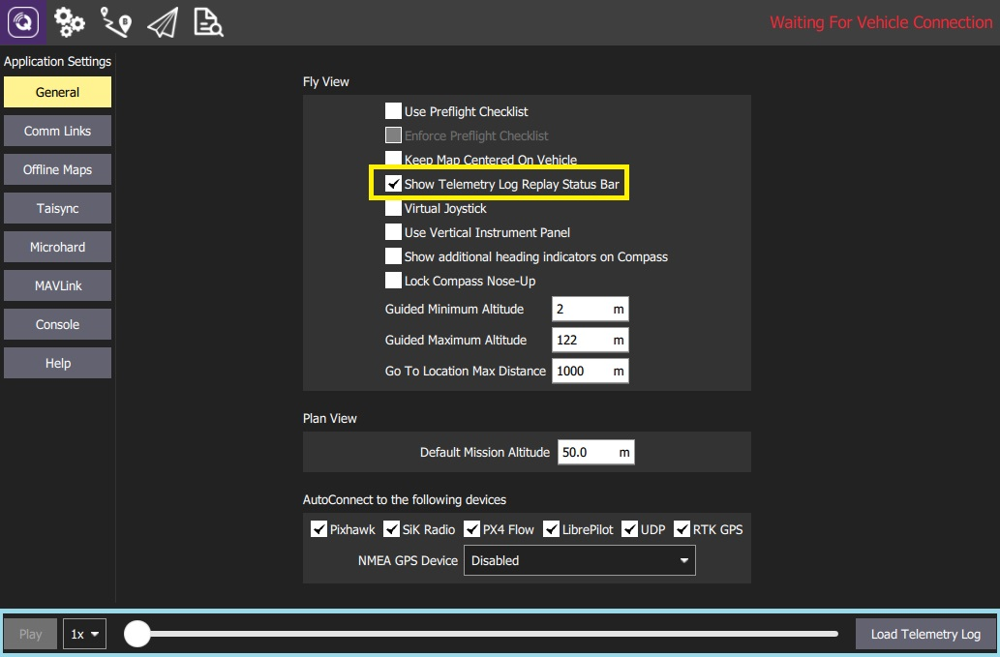

# Uçuş Verilerini Yeniden Oynat

> **Warning** Bu özellik, öncelikle ** otopilot geliştiricileri ** / ** araç tasarlayıcıları ** için tasarlanmıştır. Bu özellik, sadece bilgisayar sürümlerinde desteklenmektedir (Windows, Linux, Mac OS).

* Uçuş Verilerini Yeniden Oynat * özelliği, kullanıcıların bir telemetri günlüğünü yeniden oynatmasına olanak vererek geçmiş veya sorunlu uçuşların incelenmesine olanak tanır. Uçuş başlatılabilir, duraklatılabilir, durdurulabilir, yeniden başlatılabilir vb.

> **Note** *QGroundControl* uçuş tekrarını aktif bir bağlantı gibi görür. Oynatmayı duraklattığınızda / durdurduğunuzda, yer istasyonu "İletişim Kaybı" olarak rapor edecek ve bağlantının kesilmesini veya daha fazla komut bekleyecektir.

Bir uçuşu tekrar etmek için:
1. Tüm aktif bağlantıları kesin.
1. **Application Settings > General > Fly View**'i seçin
1. Ekranın altında uçuşu tekrar oynat butonunu görebilmek için **Show Telemetry Log Replay Status Bar**'ı işaretleyin.

   
1. *file selection* seçeneğine erişmek için **Load Telemetry Log**'a tıklayın.
   - Tekrar oynatılması için uygun telemetri kayıtlarından bir kayıt dosyası seçin.
   - * QGroundControl *, kayıtı hemen oynatmaya başlar.
1. Bir kayıt yüklendiğinde şunları kullanabilirsiniz:
   - Oynatmayı durdurmak ve yeniden başlatmak için **Pause/Play** butonuna basın.
   - Kayıtta yeni bir konuma ilerlemek için *Slider*.
   - Kaydın ne kadar hızlı oynatılacağını ayarlamak için *Rate*.
1. Oynatımı durdurmak (stop) için (ör. oynatılması için yeni bir dosya yüklemek için), ilk olarak uçuşu duraklatın (pause) ve ardından **Disconnect**'i seçin (ortaya çıktığında). Bağlantıyı kestikten sonra **Load Telemetry Log** butonu ortaya çıkacaktır.

> **Tip** You can inspect the running replay in more detail using the [MAVLink Inspector](../analyze_view/mavlink_inspector.md).
