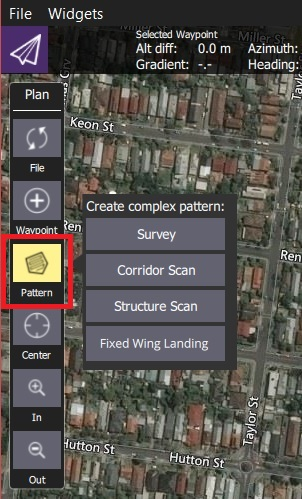

# Şablon

*Pattern tools* ([PlanView](../PlanView/PlanView.md) *Plan Tools*'un içindeki), karmaşık uçuş şablonlarını basit bir grafik kullanıcı arayüzü kullanarak özelleştirmenize olanak tanır. Uygun şablon araçları, araca (ve uçuş dizinindeki araç tipinin desteğine) bağlıdır.

| Şablon                                                         | Tanım                                                                                                                                                                                                                      | Araçlar           |
| -------------------------------------------------------------- | -------------------------------------------------------------------------------------------------------------------------------------------------------------------------------------------------------------------------- | ----------------- |
| [Yüzey](../PlanView/pattern_survey.md)                         | Çok köşeli bir alan üstünde ızgara şeklinde bir uçuş şablonu oluşturun.   
Alanı ve coğrafi etiketli görüntüler oluşturmak için uygun ızgara ve kamera ayarlarını belirleyebilirsiniz.                                     | Tüm               |
| [Yapı Taraması](../PlanView/pattern_structure_scan_v2.md)      | Dikey yüzeyler üzerinde (çok köşeli ya da dairesel) görüntüler yakalayabilmek için ızgara şeklinde bir uçuş şablonu oluşturun.   
Bunlar genellikle görsel inceleme ya da yapıların 3 boyutlu modellemesi için kullanılır. | MultiCopter, VTOL |
| [Koridor Taraması](../PlanView/pattern_corridor_scan.md)       | Çoklu çizgileri takip eden bir uçuş planı oluşturun (mesela, bir yolu gözlemlemek için).                                                                                                                                   | Tüm               |
| [Sabit Kanat İnişi](../PlanView/pattern_fixed_wing_landing.md) | Add a landing pattern for fixed wing vehicles to a mission.                                                                                                                                                                | Fixed Wing        |