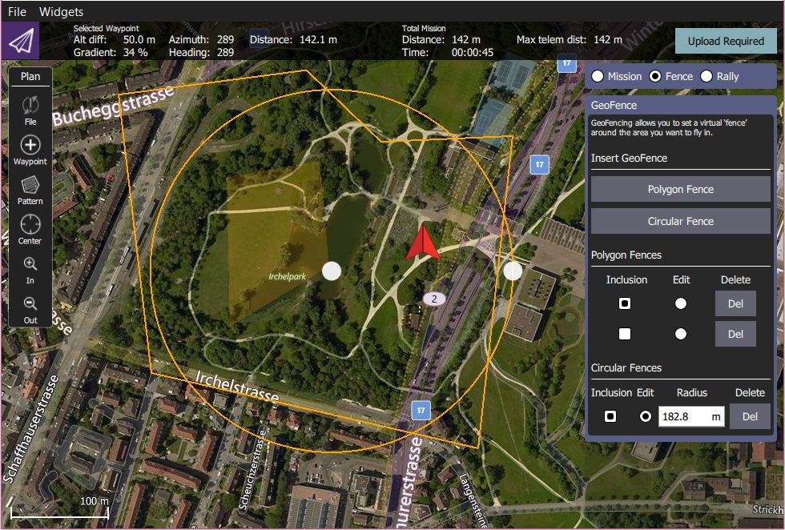
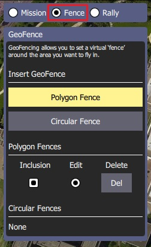
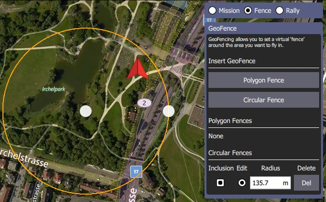
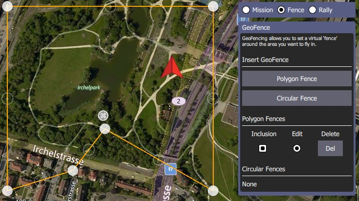

# Plan Ekranı - Coğrafi Sınır

Coğrafi Sınırlar, aracınızın içinde uçmasına izin verilen ya da *izin verilmeyen* sanal bölgeler oluşturmanıza olanak sağlar. Ayrıca eğer izin verilen alanın dışına çıkıldığında yaplıacak eylemi de ayarlayabilirsiniz.

> **Note** **ArduPilot users:** Coğrafi Sınır sadece Rover 3.6 ve Copter3.7 ve üzeri sürümlerde desteklenir. Ek olarak günlük sürümlerin ya da stabil 3.6 sürümünün (erişilebilir olduğunda) kullanılmasını gerektirir. Eğer bağlanan cihaz tarafından Coğrafi Sınır seçeneği desteklenmiyorsa *QGroundControl* seçeneği göstermeyecektir.

## Coğrafi Sınır Oluşturma

Coğrafi Sınır Oluşturmak için:

1. Plan Ekranı'na gidin
2. Görev Komutları Listesi'nin üstünden *Geofence*'i seçin
    
    

3. **Circular Fence** ya da **Polygon Fence** butonlarına basarak, sırasıyla dairesel ya da çokgen bölgeler ekleyin. Haritaya yeni bir bölge ve butonların altına sınırlarla ilgili yeni bir liste eklenecektir.
    
    > **Tip** Butonlara birden çok kez basarak birden çok bölge oluşturabilirsiniz, böylece karmaşık coğrafi sınırlar oluşturulabilir.

- Dairesel Bölge:
    
    
    
    - Merkezi noktayı kaydırarak bölgeyi haritada hareket ettirin
    - Dairenin sınırındaki noktayı sürükleyerek boyutunu ayarlayın (veya sınırlar panelindeki yarıçapı değiştirebilirsiniz).

- Çokgen Bölge:
    
    
    
    - İçi dolu noktaları sürükleyerek köşeleri hareket ettirin
    - İçi dolu noktaların arasındaki içi boş noktalara basarak yeni köşeler oluşturun. 
        1. Varsayılan olarak, *inclusion* bölgeleri olarak yeni bölgeler oluşturulur (araçlar bölge içinde kalmalıdır). Change them to exclusion zones (where the vehicle can't travel) by unchecking the associated *Inclusion* checkbox in the fence panel.

## Edit/Delete a GeoFence

You can select a geofence region to edit by selecting its *Edit* radio button in the GeoFence panel. You can then edit the region on the map as described in the previous section.

Regions can be deleted by pressing the associated **Del** button

## Upload a GeoFence

The GeoFence is uploaded in the same way as a mission, using **File** in the [Plan tools](../PlanView/PlanView.md).

## Remaining tools

The rest of the tools work exactly as they do while editing a Mission.