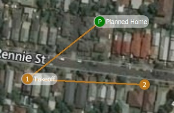
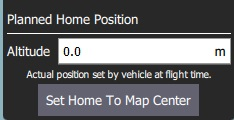
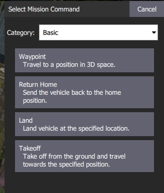

# Plan Ekranı

*Plan View*, aracınız için * otonom görevler * planlamak ve onları araca yüklemek için kullanılır. Görev [planlanıp](#plan_mission) araca gönderildiğinde, görevi gerçekleştirmek için [Uçuş Ekranı](../FlyView/FlyView.md)'na geçillir.

Ayrıca eğer yazılım tarafından destekleniyorsa [GeoFence](PlanGeoFence.md) ve [Rally Points](PlanRallyPoints.md)'leri ayalarmak için kullanılır.

## Kullanıcı Arayüzü'ne Genel Bakış {#ui_overview}

Yukarıdaki [ ekran görüntüsü ](#plan_screenshot), [ Planlanan Ev ](#planned_home) konumundan (H) kalkışla başlayan basit bir görev planını gösterir, üç hedef noktadan geçer ve ardından son hedef noktaya (yani hedef noktası 3) iner.

Arayüzün temel elemanları şunlardır:

- **Map:** [ Planlanan Ev ](#planned_home) konumu dahil olmak üzere mevcut görev için numaralandırılmış konumları görüntüler. Noktaları seçmek için tıklayın (düzenlemek için) ya da konumlarını değiştirmek için sürükleyin. 
- **Plan Araçları:** Önceki hedef noktaya göre halihazırda seçili olan hedef nokta için durum bilgisi ve tüm görevin istatistikleri (örn. Yatay mesafe ve görev süresi). 
  - `Max telem dist`, [Planlanan Ev](#planned_home) konumu ile en uzak hedef nokta arasındaki mesafedir. 
  - Bir cihaza bağlanıldığında bir **Upload** butonu da belirir ve planı araca yüklemek için kullanılabilir.
- **[Plan Araçları](#plan_tools):** Görevleri oluşturmak ve yönetmek çin kullanılır.
- **[Mission Command List/Overlay](#mission_command_list):** Mevcut görevin öğelerinin listesini görüntüler (öğeleri [düzenlemek](#mission_command_editors) için seçin).
- **Terrain Altitude Overlay:** Her görev komutunun göreceli yüksekliğini gösterir.

Size o anda seçili olan hedef noktasıyla ilgili bilgilerin yanı sıra tüm görevin istatistiklerini gösterir.

## Görev Planlama {#plan_mission}

Genel bir bakış açısıyla, görev oluşturmanın aşamaları şunlardır:

1. *Plan Ekranı*'nı açın.
2. Göreve hedef noktalar veya komutlar ekleyin, gerektiği şekilde düzenleyin.
3. Görevi araca yükleyin.
4. *Uçuş Ekranı*'nı açın ve görevi gerçekleştirin.

Aşağıdaki bölümler, ekrandaki bazı ayrıntıları açıklamaktadır.

## Planlanmış Ev Konumu {#planned_home}

*Plan View* 'de gösterilen *Planned Home*, bir görev planlanırken (mesela bir araca bağlı değilken) yaklaşık başlangıç noktasını ayarlamak için kullanılır. QGC tarafından görev sürelerini tahmin etmek ve hedef noktalar arası çizgileri çizmek için kullanılır.

Planlanan ev konumunu yaklaşık olarak kalkış yapmayı planladığınız konuma taşımanız/sürüklemeniz gerekir. Planlanan ana konumun yüksekliği, [ Mission Settings ](#mission_settings) panelinde ayarlanır.

> **Tip** Uçuş ekranı, araç devreye alındığında araın yazılımı tarafından ayarlanan *asıl* ev konumunu gösterir (bu konum, aracın Geri Dönüş/RTL modunda gideceği konumdur).

## Plan Araçları {#plan_tools}

Plan araçları, ara noktalar eklemek, karmaşık yerler için görev oluşturmayı kolaylaştırmak, görevleri yüklemek/indirmek/kaydetmek/geri yüklemek ve haritada gezinmek için kullanılır. Ana araçlar aşağıda açıklanmıştır.

> **Note** **Center map**, **Zoom In**, **Zoom Out** araçlar kullanıcıların daha iyi görüntü almasına ve *Plan Ekranı*'ndaki haritada gezinmelerine yardımcı olur (araca gönderilen görev komutlarını etkilemezler).

### Hedef Noktası Ekle

**Add Waypoint** aracına tıklayarak aktive edin. Aktifken haritaya tıklandığında, tıklanan noktaya yeni bir hedef konum eklenecektir. Tekrar tıklayana kadar araç aktif kalacaktır. Bir hedef nokta ekledikten sonra, konumunu değiştirmek için onu seçebilir ve sürükleyebilirsiniz.

### Dosya (Senkronizasyon) {#file}

* Dosya araçları *, görevleri yer istasyonu ile araç arasında taşımak ve bunları dosyalara kaydetmek/dosyalardan geri yüklemek için kullanılır. Araçlar, araca göndermediğiniz görev değişiklikleri olduğunu belirtmek için bir `! ` işareti kullanır.

> **Note** Bir görevi gerçekleştirmeden önce görevi araca yüklemeniz gerekmektedir.

*Dosya araçları* aşağıdaki fonksiyonları sağlar:

- Yükle (Araca göndermek)
- İndir (Araçtan yüklemek)
- KML dosyası dahil olmak üzere Dosyaya Kaydet/Farklı Kaydet.
- Dosyadan Yükle
- Tümünü Kaldır (tüm görev hedef noktalarını * Plan ekranından* ve araçtan kaldırır)

### Şablon

[Pattern](Pattern.md) aracı, [gözlem](../PlanView/pattern_survey.md) ve [yapı taramaları](../PlanView/pattern_structure_scan_v2.md) da dahil olmak üzere karmaşık şekillerin uçulması için görevlerin oluşturulmasını basitleştirir.

## Görev Komutları Listesi {#mission_command_list}

Mevcut görev için görev komutları ekranın sağında listelenir. En üstte görev, coğrafi sınır ve toparlanma noktaları arasında geçiş yapmak için bir dizi seçenek vardır. Listede, değerlerini düzenlemek için görev öğelerini ayrı ayrı seçebilirsiniz.

### Görev Komutları Editörü {#mission_command_editors}

Click on a mission command in the list to display its editor (in which you can set/change the command attributes).

You can change the **type** of the command by clicking on the command name (for example: *Waypoint*). This will display the *Select Mission Command* dialog shown below. By default this just displays the "Basic Commands", but you can use the **Category** drop down menu to display more (e.g. choose **All commands** to see all the options).

To the right of each command name is a menu that you can click to access to additional options such as *Insert* and *Delete*.

> **Note** The list of available commands will depend on firmware and vehicle type. Examples may include: Waypoint, Start image capture, Jump to item (to repeat mission) and other commands.

### Mission Settings {#mission_settings}

The *Mission Start* panel is the first item that appears in the [mission command list](#mission_command_list). It may be used to specify a number default settings that may affect the start or end of the mission.

#### Mission Defaults

##### Waypoint alt

Set the default altitude for the first mission item added to a plan (subsequent items take an initial altitude from the previous item). This can also be used to change the altitude of all items in a plan to the same value; you will be prompted if you change the value when there are items in a plan.

##### Flight speed

Set a flight speed for the mission that is different than the default mission speed.

#### Mission End

##### Return to Launch after mission end

Check this if you want your vehicle to Return/RTL after the final mission item.

#### Planned Home Position

The [Planned Home Position](#planned_home) section allows you to simulate the vehicle's home position while planning a mission. This allows you to view the waypoint trajectory for your vehicle from takeoff to mission completion.

> **Note** This is only the *planned* home position and you should place it where you plan to start the vehicle from. It has no actual impact on flying the mission. The actual home position of a vehicle is set by the vehicle itself when arming.

The section allows you to set the **Altitude** and **Set Home to Map Centre** (you can move it to another position by dragging it on the map).

#### Camera

The camera section allows you to specify a camera action to take, control the gimbal and set your camera into photo or video mode.

The available camera actions are:

- No change (continue current action)
- Take photos (time)
- Take photos (distance)
- Stop taking photos
- Start recording video
- Stop recording video

#### Vehicle Info

The appropriate mission commands for the vehicle depend on the firmware and vehicle type.

If you are planning a mission while you are *connected to a vehicle* the firmware and vehicle type will be determined from the vehicle. This section allows you to specify the vehicle firmware/type when not connected to a vehicle.

The additional value that can be specified when planning a mission is the vehicle flight speed. By specifying this value, total mission or survey times can be approximated even when not connected to a vehicle.

## Troubleshooting

### Mission (Plan) Upload/Download Failures {#plan_transfer_fail}

Plan uploading and downloading can fail over a noisy communication link (affecting missions, GeoFence, and rally points). If a failure occurs you should see a status message in the QGC UI similar to:

> Mission transfer failed. Retry transfer. Error: Mission write mission count failed, maximum retries exceeded.

The loss rate for your link can be viewed in [Settings View > MAVLink](../SettingsView/MAVLink.md). The loss rate should be in the low single digits (i.e. maximum of 2 or 3):

- A loss rate in the high single digits can lead to intermittent failures.
- Higher loss rates often lead to 100% failure.

There is a much smaller possibility that issues are caused by bugs in either flight stack or QGC. To analyse this possibility you can turn on [Console Logging](../SettingsView/console_logging.md) for Plan upload/download and review the protocol message traffic.

## Further Info

- New Plan View features for [QGC release v3.2](../releases/stable_v3.2_long.md#plan_view)
- New Plan View features for [QGC release v3.3](../releases/stable_v3.3_long.md#plan_view)