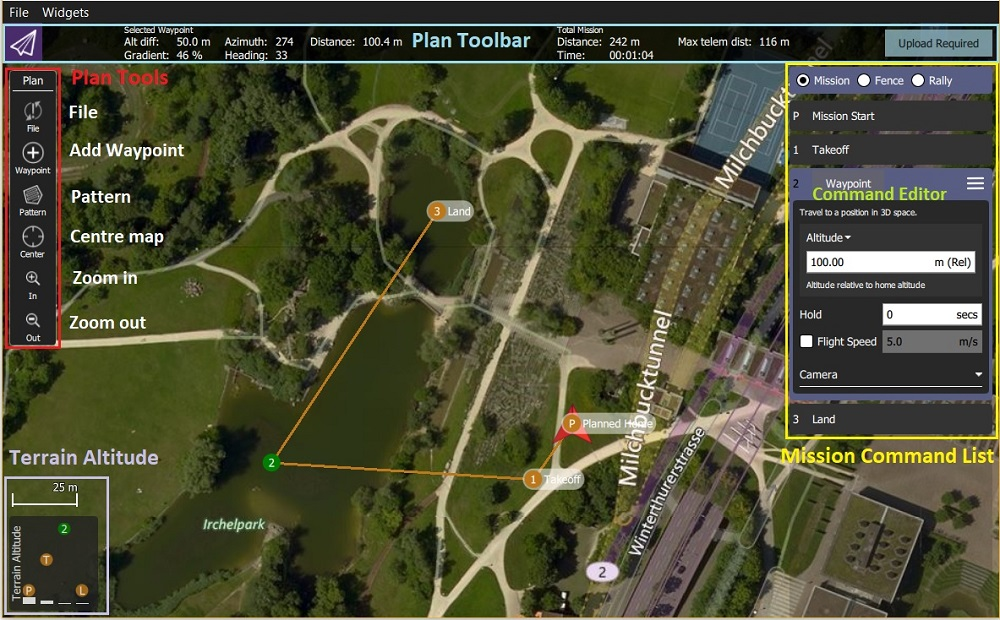
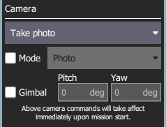

# Plan Ekranı

*Plan View*, aracınız için * otonom görevler * planlamak ve onları araca yüklemek için kullanılır. Görev [planlanıp](#plan_mission) araca gönderildiğinde, görevi gerçekleştirmek için [Uçuş Ekranı](../FlyView/FlyView.md)'na geçillir.

Ayrıca eğer yazılım tarafından destekleniyorsa [GeoFence](PlanGeoFence.md) ve [Rally Points](PlanRallyPoints.md)'leri ayalarmak için kullanılır.

## Kullanıcı Arayüzü'ne Genel Bakış {#ui_overview}

Yukarıdaki [ ekran görüntüsü ](#plan_screenshot), [ Planlanan Ev ](#planned_home) konumundan (H) kalkışla başlayan basit bir görev planını gösterir, üç hedef noktadan geçer ve ardından son hedef noktaya (yani hedef noktası 3) iner.

Arayüzün temel elemanları şunlardır:

- **Map:** [ Planlanan Ev ](#planned_home) konumu dahil olmak üzere mevcut görev için numaralandırılmış konumları görüntüler. Noktaları seçmek için tıklayın (düzenlemek için) ya da konumlarını değiştirmek için sürükleyin. 
- **Plan Araçları:** Önceki hedef noktaya göre halihazırda seçili olan hedef nokta için durum bilgisi ve tüm görevin istatistikleri (örn. Yatay mesafe ve görev süresi). 
  - `Max telem dist`, [Planlanan Ev](#planned_home) konumu ile en uzak hedef nokta arasındaki mesafedir. 
  - Bir cihaza bağlanıldığında bir **Upload** butonu da belirir ve planı araca yüklemek için kullanılabilir.
- **[Plan Araçları](#plan_tools):** Görevleri oluşturmak ve yönetmek çin kullanılır.
- **[Mission Command List/Overlay](#mission_command_list):** Mevcut görevin öğelerinin listesini görüntüler (öğeleri [düzenlemek](#mission_command_editors) için seçin).
- **Terrain Altitude Overlay:** Her görev komutunun göreceli yüksekliğini gösterir.

Size o anda seçili olan hedef noktasıyla ilgili bilgilerin yanı sıra tüm görevin istatistiklerini gösterir.

## Görev Planlama {#plan_mission}

Genel bir bakış açısıyla, görev oluşturmanın aşamaları şunlardır:

1. *Plan Ekranı*'nı açın.
2. Göreve hedef noktalar veya komutlar ekleyin, gerektiği şekilde düzenleyin.
3. Görevi araca yükleyin.
4. *Uçuş Ekranı*'nı açın ve görevi gerçekleştirin.

Aşağıdaki bölümler, ekrandaki bazı ayrıntıları açıklamaktadır.

## Planlanmış Ev Konumu {#planned_home}

*Plan View* 'de gösterilen *Planned Home*, bir görev planlanırken (mesela bir araca bağlı değilken) yaklaşık başlangıç noktasını ayarlamak için kullanılır. QGC tarafından görev sürelerini tahmin etmek ve hedef noktalar arası çizgileri çizmek için kullanılır.

Planlanan ev konumunu yaklaşık olarak kalkış yapmayı planladığınız konuma taşımanız/sürüklemeniz gerekir. Planlanan ana konumun yüksekliği, [ Mission Settings ](#mission_settings) panelinde ayarlanır.

> **Tip** Uçuş ekranı, araç devreye alındığında araın yazılımı tarafından ayarlanan *asıl* ev konumunu gösterir (bu konum, aracın Geri Dönüş/RTL modunda gideceği konumdur).

## Plan Araçları {#plan_tools}

Plan araçları, ara noktalar eklemek, karmaşık yerler için görev oluşturmayı kolaylaştırmak, görevleri yüklemek/indirmek/kaydetmek/geri yüklemek ve haritada gezinmek için kullanılır. Ana araçlar aşağıda açıklanmıştır.

> **Note** **Center map**, **Zoom In**, **Zoom Out** araçlar kullanıcıların daha iyi görüntü almasına ve *Plan Ekranı*'ndaki haritada gezinmelerine yardımcı olur (araca gönderilen görev komutlarını etkilemezler).

### Hedef Noktası Ekle

**Add Waypoint** aracına tıklayarak aktive edin. Aktifken haritaya tıklandığında, tıklanan noktaya yeni bir hedef konum eklenecektir. Tekrar tıklayana kadar araç aktif kalacaktır. Bir hedef nokta ekledikten sonra, konumunu değiştirmek için onu seçebilir ve sürükleyebilirsiniz.

### Dosya (Senkronizasyon) {#file}

* Dosya araçları *, görevleri yer istasyonu ile araç arasında taşımak ve bunları dosyalara kaydetmek/dosyalardan geri yüklemek için kullanılır. Araçlar, araca göndermediğiniz görev değişiklikleri olduğunu belirtmek için bir `! ` işareti kullanır.

> **Note** Bir görevi gerçekleştirmeden önce görevi araca yüklemeniz gerekmektedir.

*Dosya araçları* aşağıdaki fonksiyonları sağlar:

- Yükle (Araca göndermek)
- İndir (Araçtan yüklemek)
- KML dosyası dahil olmak üzere Dosyaya Kaydet/Farklı Kaydet.
- Dosyadan Yükle
- Tümünü Kaldır (tüm görev hedef noktalarını * Plan ekranından* ve araçtan kaldırır)

### Şablon

[Pattern](Pattern.md) aracı, [gözlem](../PlanView/pattern_survey.md) ve [yapı taramaları](../PlanView/pattern_structure_scan_v2.md) da dahil olmak üzere karmaşık şekillerin uçulması için görevlerin oluşturulmasını basitleştirir.

## Görev Komutları Listesi {#mission_command_list}

Mevcut görev için görev komutları ekranın sağında listelenir. En üstte görev, coğrafi sınır ve toparlanma noktaları arasında geçiş yapmak için bir dizi seçenek vardır. Listede, değerlerini düzenlemek için görev öğelerini ayrı ayrı seçebilirsiniz.

### Görev Komutları Düzenleyicisi {#mission_command_editors}

Düzenleyicisini görüntülemek için listedeki bir görev komutuna tıklayın (buradan komut özellikerini ayarlayabilir/değiştirebilirsiniz).

Komut adına tıklayarak komutun ** tipini ** değiştirebilirsiniz (örneğin: *Waypoint*). Bu, aşağıda gösterilen * Select Mission Command* diyaloğunu görüntüler. Varsayılan olarak bu sadece "Temel Komutlar" görüntülenir, daha fazlasını görüntülemek için ** Category** açılır menüsünü kullanabilirsiniz (örneğin tüm seçenekleri görmek için ** All commands ** 'ı seçin).

Her komut adının sağında, * Ekle * ve * Sil * gibi ek seçeneklere erişmek için tıklayabileceğiniz bir menü bulunur.

> **Note** Kullanılabilir komutların listesi aracın yazılımına ve türüne bağlıdır. Örnek olarak şunlar verilebilir: Hedef nokta, Görüntü yakalamayı başlat, Öğeye atla (görevi tekrarlamak için) ve diğer komutlar.

### Görev Ayarları {#mission_settings}

*Mission Start* paneli [ görev komut listesinde ](#mission_command_list) görünen ilk öğedir. Görevin başlangıcını veya sonunu etkileyebilecek bir takım varsayılan ayarı düzenlemek için kullanılabilir.

#### Görevin Varsayılan Ayarları

##### Hedef Noktanın Yüksekliği

Bir plana eklenen ilk görev öğesi için varsayılan irtifayı ayarlayın (sonraki öğeler, önceki öğeden ilk irtifayı alır). Bu aynı zamanda bir plandaki tüm öğelerin yüksekliğni aynı değere ayarlamak için de kullanılabilir; planda öğeler varken eğer değeri değiştirirseniz bu seçenek size sorulacaktır.

##### Uçuş Hızı

Görev için varsayılan görev hızından farklı bir uçuş hızı belirleyin.

#### Görevin Sonu

##### Görev bittiğinde kalkış yerine dön

Aracınızın son görev öğesinden sonra Geri Dönmesini/RTL istiyorsanız bunu işaretleyin.

#### Planlanmış Ev Konumu

[Planned Home Position ](#planned_home) bölümü, bir görev planlarken aracın ev konumunu simüle etmenizi sağlar. Bu, kalkıştan görevin tamamlanmasına kadar aracınızın hedef noktalar arası rotasını görüntülemenizi sağlar.

> **Note** Bu yalnızca * planlanan * ev konumudur ve aracı çalıştırmayı planladığınız yere konumlandırılmalıdır. Görevin gerçekleşmesinde gerçek bir etkisi yoktur. Asıl ev konumu, araç tarafından devreye alınırken ayarlanır.

Bu bölüm, **Altitude** ve ** Set Home to Map Centre** 'ı ayarlamanıza olanak tanır (haritada sürükleyerek başka bir konuma taşıyabilirsiniz).

#### Kamera

Kamera bölümü, gerçekleştirilecek bir kamera eylemi belirlemenizi, gimbali kontrol etmenizi ve kameranızı fotoğraf veya video moduna ayarlamanızı sağlar.

Mevcut kamera eylemleri şunlardır:

- Değişiklik yok (mevcut eyleme devam et)
- Fotoğraf çek (zaman aralıklı)
- Fotoğraf Çek (mesafe aralıklı)
- Fotoğraf çekimini durdur
- Video çekmeye başla
- Video çekimi durdur

#### Araç Bilgisi

The appropriate mission commands for the vehicle depend on the firmware and vehicle type.

If you are planning a mission while you are *connected to a vehicle* the firmware and vehicle type will be determined from the vehicle. This section allows you to specify the vehicle firmware/type when not connected to a vehicle.

The additional value that can be specified when planning a mission is the vehicle flight speed. By specifying this value, total mission or survey times can be approximated even when not connected to a vehicle.

## Troubleshooting

### Mission (Plan) Upload/Download Failures {#plan_transfer_fail}

Plan uploading and downloading can fail over a noisy communication link (affecting missions, GeoFence, and rally points). If a failure occurs you should see a status message in the QGC UI similar to:

> Mission transfer failed. Retry transfer. Error: Mission write mission count failed, maximum retries exceeded.

The loss rate for your link can be viewed in [Settings View > MAVLink](../SettingsView/MAVLink.md). The loss rate should be in the low single digits (i.e. maximum of 2 or 3):

- A loss rate in the high single digits can lead to intermittent failures.
- Higher loss rates often lead to 100% failure.

There is a much smaller possibility that issues are caused by bugs in either flight stack or QGC. To analyse this possibility you can turn on [Console Logging](../SettingsView/console_logging.md) for Plan upload/download and review the protocol message traffic.

## Further Info

- New Plan View features for [QGC release v3.2](../releases/stable_v3.2_long.md#plan_view)
- New Plan View features for [QGC release v3.3](../releases/stable_v3.3_long.md#plan_view)