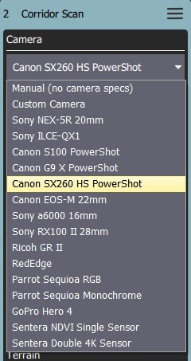
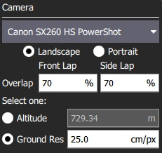
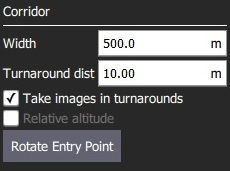

# Koridor Taraması (Plan Şablonu)

Koridor taraması, çoklu çizgileri takip eden bir uçuş şablonu oluşturmanıza olanak verir. Bu, mesela, bir yolu gözlemlemek için kullanılır. Tüm otopilot ve araç tiplerince desteklenir.

> **Important** Kamera özelliklerini kullanan bir Koridor Taraması planlarken, araştırma alanınızın zemin yüksekliklerinin kalkış/ev konumunuzla aynı yükseklikte olduğu varsayılır. Eğer araştırma alanınızın zemin yüksekliği fırlatma/ev konumunuzdan daha yüksek veya daha alçaksa, görüntülerinizdeki etkili örtüşme hesaplanandan daha az veya daha fazla (sırasıyla) olacaktır. Araştırma alanınızın zemin yüksekliği fırlatma/ev konumunuzdan önemli ölçüde daha yüksekse, aracın yanlışlıkla ağaçlara, engellere veya zemine çarpmasına neden olacak bir görev planlayabilirsiniz. Kalkış/ev rakımınızdan önemli yükseklik farklılıkları olan arazi üzerinde istenen yükseklik farkını daha yakından koruyan bir tarama oluşturmak için Terrain Follow'u kullanın.

Coğrafi etiketli görüntüler oluşturmak için uygun yolu, koridor genişliğini ve kamera ayarlarını özelleştirebilirsinz.

## Tarama Oluşturma

Bir koridor taraması oluşturmak için:

1. [PlanView](../PlanView/PlanView.md)'den *Plan Tools*'u açın.
2. *Plan Tools* 'dan *Pattern Tool*'u seçin ve *Corridor Scan*'a tıklayın.
  
  
  
  Bu haritaya bir koridor ve görev listesine (sağda) bir *Corridor Scan* öğesi ekleyecektir.

3. Koridorun uçlarını, sırasıyla taramanın başlangıç ve bitiş noktalarına sürükleyin.

4. Yeni bir köşe noktası oluşturmak için hattın ortasındaki `(+)` semboüne tıklayın. Yeni köşe noktası, istenen koridor yolunu takip edeceği bir noktaya sürüklenebilir.

Koridor taraması ayarları bir sonraki bölümde ele alınmıştır.

## Ayarlar

Koridor taraması, ilişkili görev öğesinde (Plan Görünümü'nün sağ tarafındaki görev öğesi listesinde) daha da yapılandırılabilir.

### Kamera

Kamera başlatma davranışı, kamera/kamera ayarlarına bağlıdır. You can select an existing camera or manually enter the settings. The list of available cameras (QGC 3.4) is given below.

#### Known Camera

Selecting a known camera from the option dropdown allows you to generate a grid pattern based on the camera's specifications.

The configurable options are:

- **Landscape/Portrait** - Camera orientation relative to the "normal" orientation of the vehicle.
- **Image Overlap** - Overlap between each image.
- Select one of: 
  - **Altitude** - Survey altitude (ground resolution will be calculated/displayed for this altitude).
  - **Ground resolution** - Ground resolution for each image (altitude required to achieve this resolution calculated and shown).

#### Manual Camera

The manual camera option allows you to specify desired survey height, trigger interval and appropriate grid spacing for your camera.

The configurable options are:

- **Altitude** - Survey altitude.
- **Trigger Distance** - The distance over ground between each camera shot.
- **Spacing** - Distance between adjacent grid (flight path) lines across the corridor.

### Corridor

The configurable options are:

- **Width** - Set the width of the scan around the polyline that defines the path.
- **Turnaround dist** - Amount of additional distance to add outside the survey area for vehicle turn around.
- **Take images in turnarounds** - Check to enable image capture a turnaround points.
- **Relative altitude** - Check to specify a relative altitude. This is only supported for manual grids that are not using [terrain following](#terrain_following).
- **Rotate entry point** - Press button to swap the start and end point of the corridor scan.

### Terrain Following {#terrain_following}

By default a flying vehicle will follow the corridor path at a fixed altitude. Enabling *Terrain Following* makes the vehicle maintain a constant height relative to ground.

> **Note** Terrain following uses terrain heights queried from *AirMap* servers.

The configurable options are:

- **Vehicle follows terrain** - Check to enable terrain following (and display the following options). 
  - **Tolerance** - The accepted deviation in altitude from the target altitude.
  - **Max Climb Rate** - Maximum climb rate when following terrain.
  - **Max Descent Rate** - Maximum descent rate when following terrain.

### Statistics

The *Statistics* section shows the calculated survey area, photo interval, photo spacing and planned photo count.

