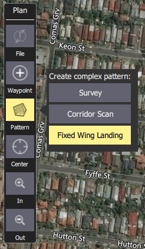
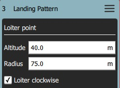

# Sabit Kanat İniş Yolu (Plan Şablonu)

*Fixed Wing Landing Pattern* aracı, göreve sabit kanat iniş yolu eklemenize olanak tanır. Hem ArduPilot hem de PX4'de desteklenir.

Yolun ilk noktası, belirli bir yükseklikte oyalanacağı yer; ikincisi de iniş noktasıdır. Araç, ilk noktada hedeflenen yüksekliğe erişene kadar oyalanacaktır, ardından iniş için belirlenen iniş noktasına doğru alçalmaya başlayacaktır.

Hem oyalanma hem de iniş noktaları, istenilen yeni noktalara sürüklenebilir ve ilişkili görev öğesinden bir takım başka ayarlar yapılabilir.

## İniş Yolu Oluşturma

İniş yolu oluşturmak için:

1. Open [PlanView](../PlanView/PlanView.md)'den *Plan Tools*'u açın.
2. *Plan Tools* 'dan *Plan Tools*'u açın ve *Fixed Wing Landing Pattern*'i seçin.
  
  
  
  Bu, görev listesine (sağda) *Landing Pattern* öğesi ekleyecektir.
  
  

3. Oyalanma ve iniş noktalarını ayarlamak için haritaya tıklayın. Bu noktalar harita üzerinde hareket ettirilebilir.

Ek ayarlar bir sonraki bölümde ele alınmıştır.

## Ayarlar

İniş yolu, ilişkili görev öğesinde (Plan Görünümü'nün sağ tarafındaki görev öğesi listesinde) daha da yapılandırılabilir.

### Oyalanma Noktası

*Loiter Point* ayarları, oyalanmanın yüksekliğini, yarı çapını ve yönünü ayarlamak için kullanılır.

Ayarlanabilir seçenekler şunlardır:

- **Altitude** - Oyalanma yüksekliği.
- **Radius** - Oyalanma yarıçapı.
- **Loiter clockwise** - Oyalanmanın yönünün saat yönü olması için işaretleyin (varsayılan olarak yön, saat yönünün tersidir). 

### İniş noktası

*Landing Point* ayarları, iniş pozisyonunu ve yolunu ayarlamak için kullanılır.

Ayarlanabilir seçenekler şunlardır:

- **Heading** - Heading from loiter point to land point.
- **Altitude** - Altitude for landing point (nominally zero).
- *Radio Buttons* 
  - **Landing Dist** - Distance between loiter and landing points.
  - **Glide Slope** - Glide slope between loiter and landing points.
- **Altitudes relative to home** - Check to set all altitudes in mission item to be relative to home (default is AMSL).

## Implementation

This pattern creates three mission items:

- `DO_LAND_START` - If you abort a landing it sends `DO_GO_AROUND` to the vehicle, which then causes the mission to return to this point and try to land again.
- `NAV_LOITER_TO_ALT` - Start point for landing
- `NAV_LAND` - End point for landing

The vehicle flares to landing using a flight path generated by the firmware between the `NAV_LOITER_TO_ALT` point and the `NAV_LAND` point.

If those two locations violate the vehicle's flare constraints (e.g. descent angle is too steep) an error will be raised after you upload the invalid mission to the vehicle.

> **Note** On PX4, violating the flare constraints sends an error message to the ground station at upload time, and the autopilot will refuse to start the mission (since it fails integrity checks).