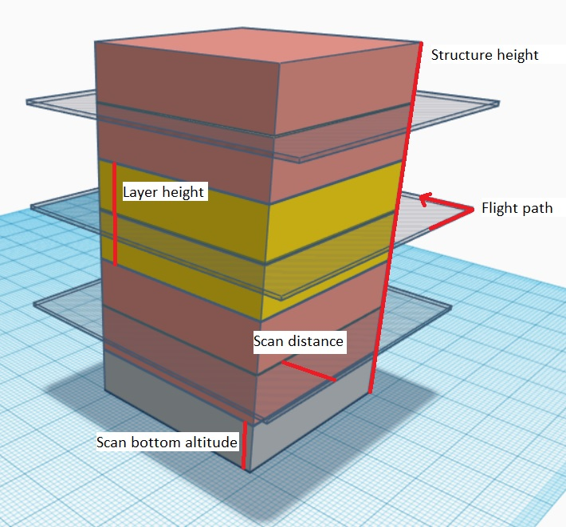
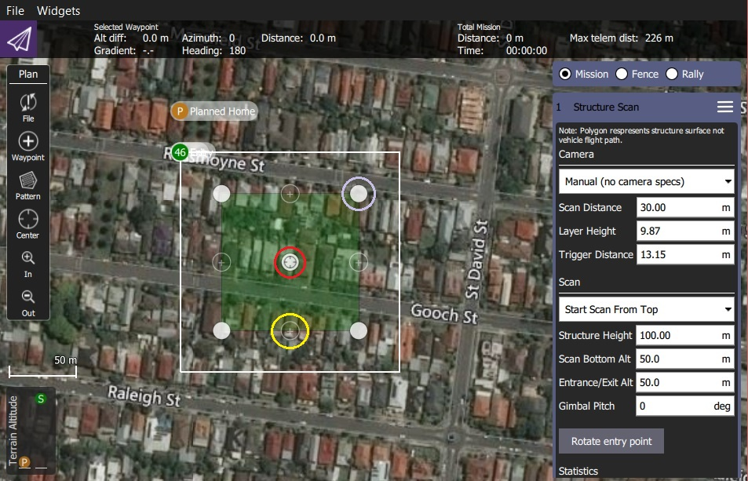
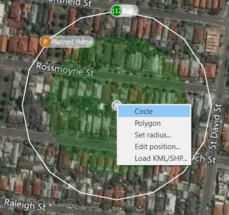
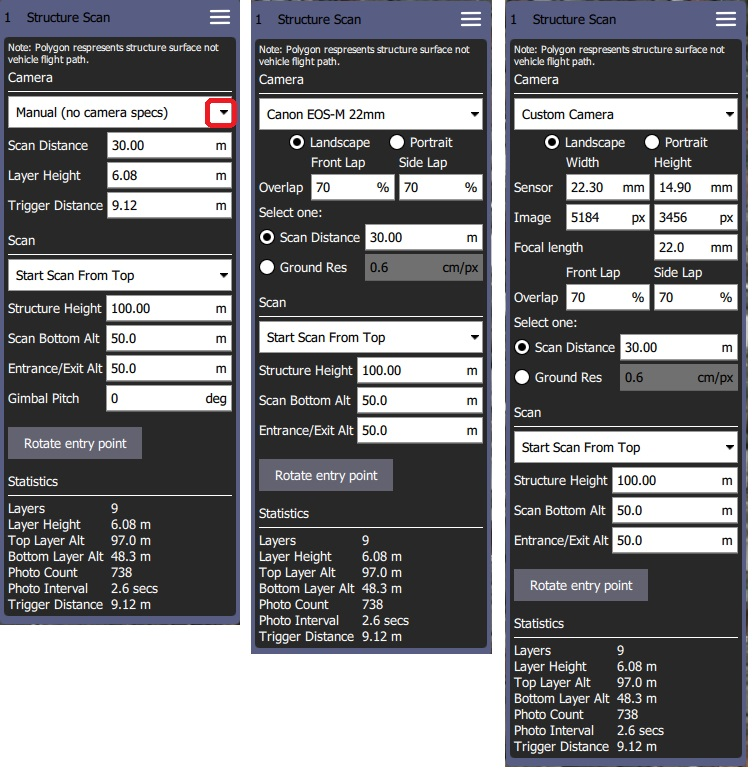

# Yapı Taraması (Plan Şablonu)

*Structure Scan*, çok köşeli (veya dairesel) zemin ayak izine sahip bir yapının *dikey yüzeyleri* üzerinde (ör. duvarlar) görüntüler yakalayabilmek için ızgara şeklinde bir uçuş şablonu oluşturmanıza olanak sağlar. Yapı Taraması genellikle görsel inceleme ya da yapıların 3 boyutlu modellemesi için kullanılır.

*Yapı Taramaları*, Plan ekranında **Pattern > Structure Scan** aracı kullanılarak bir görevin içine yerleştirilebilir.

> **Note** *Structure Scan*'ın yeni versiyonu, eski *Structure Scan* planlarını okuyamaz. Eskilerin tekar oluşturulmaları gerekir.

> **Warning** Bu özellik henüz ArduPilot yazılımı tarafından desteklenmemektedir. PX4'de desteklenir.

## Genel Bakış

Aşağıdaki resim, yapı taramasının bir ekran görüntüsünü göstermektedir. Yeşil çokgen, yapının zemin ayak izini işaretlemek için kullanılırken, etrafındaki beyaz çizgi aracın uçuş yolunu gösterir. Uçuş yolundaki yeşil numaralı daire, taramaya giriş/çıkış noktasıdır (taramanın başladığı yer).

Tarama, yapıyı eşit olarak katmanlara ayırır; araç, yapının çevresinde belirli bir irtifada ve yapıya * scan distance*'den uçar, ardından tüm yüzey taranana kadar işlemi her katmanda tekrarlar.

Kullanıcılar, yapının altındaki engellerden kaçınmak için *scan bottom altitude* ve araç taramaya / taramaya giderken engellerden kaçınmak için *entrance/exit altitude* ayarlayabilir.

## Tarama Oluşturma

Tarama oluşturmak için:

1. **Plan View**'den **Pattern tool > Structure Scan**'ı seçin.
  
  

2. Bu haritada basit kare bir yapı taraması oluşturacaktır.
  
  
  
  Yeşil bölge, yapıyı kaplayacak şekilde düzenlenmelidir.
  
  - Haritadaki opak köşeleri yapının kenarlarına sürükleyin (yukarıda leylak rengi daire içine alınmış köşeler). 
  - Yapının kapladığı alan basit bir kareden fazlaysa, yeni bir köşe noktası oluşturmak için köşeler arasındaki yarı saydam dairelere tıklayabilirsiniz.

3. Ayrıca merkezdeki "daire"ye (kırmızı ile işaretlenmiş) tıklayarak ve açılır menüden *Circle* 'ı seçerek dairesel bir alana geçebilirsiniz.
  
  .
  
  - Açılır menüden çokgen alana geri dönebilir ve taramanın yarıçapını ve/veya konumunu değiştirebilirsiniz.
  - Çemberin merkezini konumlandırmak için merkezdeki daireyi sürükleyin. 

4. Geri kalan düzenlemeler, ekranın sağındaki *Structure Scan* editörü kullanılarak halledilir. İlk olarak manuel tarama, belirli bir kamera kullanarak tarama veya özel bir kamera tanımı kullanarak tarama seçeneklerinden hangisini istediğinizi seçin.
  
  > **Note** The main difference between the modes is that predefined cameras are already set up to correctly calculate an effective layer height and trigger distance.
  
  Options for the different modes are shown below.
  
  

The user can always configure the following settings:

- **Start scan from top/bottom:** The direction in which layers are scanned.
- **Structure height:** The height of the object being scanned.
- **Scan distance:** Distance from the structure of the flight path.
- **Entrance/Exit Alt:** Use this setting to avoid obstacles between the last/next waypoint and the structure to be scanned. 
  - The vehicle will fly to the *Entrance/Exit* point at this altitude and then descend to the initial layer to start the scan. 
  - The vehicle will ascend to this altitude after completing the scan and then move to the next waypoint.
- **Scan Bottom Alt:** Use this setting to avoid obstacles around the base of the structure. This adjust the bottom of the structure to be above the ground, and hence the altitude of the first scan (the height of the lowest layer flight path is shown in the scan statistics as *Bottom Layer Alt*.
- **Rotate Entry Point:** Move the start/finish point to the next vertix/position on the flight path.

The remaining settings depend on the *camera mode*:

- *Manual Mode* allows you to specify: 
  - **Layer height:** The height of each layer.
  - **Trigger Distance:** The distance between each camera trigger. The camera is only triggered while flying the layer path. It does not trigger images while transitioning from one layer to the next.
  - **Gimbal Pitch** - Gimbal pitch you want to use for the scan.

- *Known/pre-defined cameras* automatically calculates layer heights and image triggering from required image overlap, and allows you to trade off scan distance and require image resolution. It also ensures that the camera is always pointed directly at the right angles to the surface which it is capturing images. The settings are:
  
  - **Camera Orientation:** Portrait or Landscape
  - *Overlap*: 
    - **Front Lap:** Image overlap from top to bottom (increasing shrinks layer height and increases layer count).
    - **Side Lap:** Image overlap at sides (increasing takes more images in each lap/layer scan).
  - **Scan distance:** Distance from the structure of the flight path.
  - **Ground Res:** Required image resolution/sample quality of surface.

- *Custom camera* selection allows you to enter your own camera characteristics, but otherwise behaves the same as a predefined camera.