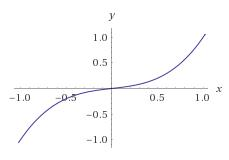
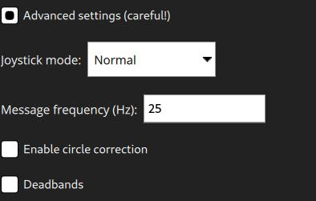
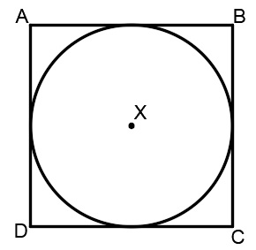

# Joystick Kurulumu

* QGroundControl *, bir aracı RC Verici yerine bir joystick veya gamepad kullanarak kontrol etmenizi sağlar.

> ** Note ** Bir Joystick (veya [ sanal analoglar ](../SettingsView/VirtualJoystick.md)) ile uçmak, aracın kumanda kolu hareketlerine yanıt vermesini sağlamak için güvenilir bir yüksek bant genişliğine sahip telemetri kanalı gerektirir (çünkü joystick bilgileri MAVLink üzerinden gönderilir).

<span></span>

> ** Note ** Joystick ve Gamepad desteği, çapraz platform [ SDL2 ](http://www.libsdl.org/index.php) kitaplığı kullanılarak etkinleştirilir. Belirli bir kontrolcüyle uyumluluk, SDL'ye bağlıdır (bu API tarafından gösterilen tüm düğmeler, * QGroundControl * arayüzü aracılığıyla görüntülenir). [Çok sayıda yaygın oyun çubuğu ve oyun kolunun ](#supported-joysticks) çalıştığı bilinmektedir.

<span></span>

> ** Not ** Kumanda kolu, kalibrasyon işleminin son adımı olarak * etkinleştirilir *.

## PX4 Joystick Desteğini Etkinleştirme

PX4'te Joystick desteğini etkinleştirmek için ` COM_RC_IN_MODE ` parametresini 1 - * Joystick/No RC Checks * olarak ayarlamanız gerekir. Bu parametre ayarlanmazsa, * Joystick * bir kurulum seçeneği olarak sunulmayacaktır.

Bu, PX4 SITL yapıları için varsayılan olarak etkindir (belirli bir parametrenin nasıl bulunacağı ve ayarlanacağı hakkında bilgi için [Parametreler](../SetupView/Parameters.md) konusuna bakın).

## Ardupilot Joystick Desteği

Tüm ArduPilot araçları desteklenmektedir. Parametre yapılandırmasına gerek yoktur.

## Joystick'i Ayarlama {#configure}

Joystick'i ayarlamak için:

1. * QGroundControl * 'ı başlatın ve bir araca bağlayın.
2. Joystick ya da Gamepad'i bir USB portuna bağlayın.
3. Üstteki araç çubuğundan **dişli** simgesini (Vechicle Setup), daha sonra kenar çubuğundan **Joystick**'i seçin. Aşağıdaki ekran görünecektir.
    
    

4. ** Active joystick ** açılır menüsünde kumanda çubuğunuzun seçildiğinden emin olun.

5. **Calibrate ** Sekmesine gidin, ** Start ** tuşuna basın ve sonra çubukları kalibre etmek/hareket ettirmek için ekrandaki talimatları izleyin.
    
    
    
    Joystick, kalibrasyon işleminin son adımı olarak * etkinleştirilir *.

6. Düğmelerin ve çubukların amaçlandığı gibi çalışıp çalışmadığını onlara basarak ve sonucu ** General ** sekmesindeki Axis/Buton monitöründe görüntüleyerek test edin.

7. Her bir kumanda kolu düğmesiyle etkinleştirilen uçuş modlarını/araç işlevlerini seçin. 

## Gelişmiş Seçenekler

Bazı ek Seçenekler ** Advanced ** sekmesinde mevcuttur. Bu seçenekler, duyarlılığı artırmak için belirli alışılmadık kurulumlarda ve sıkıntılı joystickleri kullanmak için yararlı olabilir.

### Gaz Kolu Seçenekleri


- **Center stick is zero throttle**: Ortalanmış veya alçaltılmış gaz çubuğu [ MANUAL_CONTROL **z** ](https://mavlink.io/en/messages/common.html#MANUAL_CONTROL) ile 0, kaldırılmış gaz çubuğu 1000 gönderir. 
    - **Spring loaded throttle smoothing**: Bu modda gazın kendisini değil, artıp / azaldığı hızı kontrol edersiniz. Bu, gaz kolunun yaylı olduğu kurulumlar için kullanışlıdır, çünkü kullanıcı çubuğu bırakarak gazı istenen seviyede tutabilir.
- **Full down stick is zero throttle**: Bu modda, alçaltılmış çubuk [ MANUAL_CONTROL **z** ](https://mavlink.io/en/messages/common.html#MANUAL_CONTROL) için 0, ortalanmış çubuk 500 ve kaldırılmış çubuk 1000 gönderir.
- **Allow negative thrust**: ** Center stick is zero throttle ** modundayken, bu mod, kullanıcının çubuğu indirerek negatif değerler göndermesini sağlar. Böylece, indirilen çubuk [ MANUAL_CONTROL **z** ](https://mavlink.io/en/messages/common.html#MANUAL_CONTROL) 'de -1000 gönderir, ortalanmış çubuk 0 gönderir ve yükseltilmiş çubuk 1000 gönderir. Bu mod sadece [ Rover ](http://ardupilot.org/rover/index.html) gibi negatif itişi destekleyen araçlar için etkinleştirilebilir.

### Expo

Expo kaydırıcısı, çubukları merkezde daha az hassas hale getirmenize ve bu bölgede daha iyi kontrol sağlamanıza olanak tanır.


Kaydırıcı, üstel eğrinin eğriliğini ayarlar.



Expo değeri ne kadar yüksekse, eğri merkezde o kadar düz ve kenarlarda diktir.

### Gelişmiş Ayarlar

Gelişmiş ayarlar, günlük kullanıcılar için önerilmez. Yanlış kullanılırlarsa beklenmeyen sonuçlara neden olabilirler.



Şu seçenekler mevcuttur:

- **Enable Gimbal Control**: Bir gimbali kontrol etmek için iki ek kanal etkinleştirilir.

- **Joystick Mode**: Joystick'in gerçekte neyi kontrol ettiğini ve araca gönderilen MAVLink mesajlarını değiştirir.
    
    - **Normal**: Kullanıcı normal bir RC radyo kullanıyormuş gibi kontrol eder, MAVLink [ MANUAL_CONTROL ](https://mavlink.io/en/messages/common.html#MANUAL_CONTROL) mesajları kullanılır.
    - **Attitude**: Kullanıcı aracın duruşunu kontrol eder, MAVLink [ SET_ATTITUDE_TARGET ](https://mavlink.io/en/messages/common.html#SET_ATTITUDE_TARGET) mesajları kullanılır.
    - **Position**: Kullanıcı araç konumunu kontrol eder, ** konumu ** için yalnızca bit maskeli MAVLink [ SET_POSITION_TARGET_LOCAL_NED ](https://mavlink.io/en/messages/common.html#SET_POSITION_TARGET_LOCAL_NED) mesajları kullanılır.
    - **Force**: Kullanıcı araca uygulanan kuvvetleri kontrol eder, ** kuvvet ** için yalnızca bit maskeli MAVLink [ SET_POSITION_TARGET_LOCAL_NED ](https://mavlink.io/en/messages/common.html#SET_POSITION_TARGET_LOCAL_NED) mesajları kullanılır.
    - **Velocity**: Kullanıcı araca uygulanan kuvvetleri kontrol eder, ** hız ** için yalnızca bit maskeli MAVLink [ SET_POSITION_TARGET_LOCAL_NED ](https://mavlink.io/en/messages/common.html#SET_POSITION_TARGET_LOCAL_NED) mesajları kullanılır.

- **Axis Frequency**: When the joystick is idle (inputs are not changing), the joystick commands are sent to the vehicle at 5Hz. When the joystick is in use (input values are changing), the joystick commands are sent to the vehicle at the (higher) frequency configured by this setting. The default is 25Hz.

- **Button Frequency**: Controls the frequency at which repeated button actions are sent.

- **Enable Circle Correction**: RC controllers sticks describe a square, while joysticks usually describe a circle. When this option is enabled a square is inscribed inside the joystick movement area to make it more like an RC controller (so it is possible to reach all four corners). The cost is decreased resolution, as the effective stick travel is reduced.
    
    - **Disabled:** When this is **disabled** the joystick position is sent to the vehicle unchanged (the way that it is read from the joystick device). On some joysticks, the (roll, pitch) values are confined to the space of a circle inscribed inside of a square. In this figure, point B would command full pitch forward and full roll right, but the joystick is not able to reach point B because the retainer is circular. This means that you will not be able to achieve full roll and pitch deflection simultaneously.
    
    
    
    - **Enabled:** The joystick values are adjusted in software to ensure full range of commands. The usable area of travel and resolution is decreased, however, because the area highlighted grey in the figure is no longer used.
    
    

- **Deadbands:** Deadbands allow input changes to be ignored when the sticks are near their neutral positions. This helps to avoid noise or small oscillations on sensitive sticks which may be interpreted as commands, or small offsets when sticks do not re-center well. They can be adjusted during the first step of the [calibration](#configure), or by dragging vertically on the corresponding axis monitor.

## Supported Joysticks

The following joysticks/controllers have been shown to work with relatively recent *QGroundControl* builds.

### Sony Playstation 3/4 Controllers

These are both highly recommended. They work well "out of the box" and have many buttons that you can map to flight modes.

#### Sony PS4 - DualShock 4 Controller V2 (Wireless setup)

This controller supports both USB and Bluetooth wireless connection. Wired USB connection usually works out of the box. The wireless connection needs some setup.

##### Linux Ubuntu setup

To make the controller work wirelessly under Linux the [jstest-gtk](https://jstest-gtk.gitlab.io/) and [ds4drv](https://github.com/chrippa/ds4drv) utilities are needed.

The steps are:

1. Install *jstest-gtk*: ```sudo apt install jstest-gtk```
2. Install *ds4drv*: ```sudo pip install ds4drv```
3. Run ds4drv ```sudo ds4drv```
4. Hold **Share** button and then **PS** button until controller LED starts blinking rapidly. The *ds4drv* should then detect a new device.
5. Last of all, you should check the controller setup by running the *jstest-gtk* utility. 

### FrSky Taranis XD9 plus

The *FrSky Taranis XD9 plus* remote control can also be connected as a joystick. You will need to connect it via the USB port on the back.

The Taranis does not allow you to use button options (to be precise, you can set the options, but toggling the buttons on your transmitter does not cause them to be pressed).

> **Note** The Taranis is an open system that is openly being worked on. It is possible that at time of writing there is a firmware or configuration that allows it to work effectively as a joystick.

### Logitech Gamepad F310

The Logitech Gamepad F310 has been tested via USB on MacOSX "Sierra".

### Logitech Extreme 3D Pro

The [Logitech Extreme 3D Pro](http://gaming.logitech.com/en-ch/product/extreme-3d-pro-joystick) Joystick has been tested on all platforms (Linux, Windows, Mac OSX). This is a single stick controller that can also be twisted. The main stick axes are used for pitch and roll, while the twist action is used for yaw. The throttle is mapped onto a separate wheel.

### Logitech F710 Gamepad

<!-- This is from http://qgroundcontrol.org/users/joystick -->

This gamepad is great for flying a multirotor manually via QGroundControl. It works on Windows, Linux and Mac OS.

#### Mac OS Leopard / Lion Setup

The F710 is detected under Leopard / Lion but is not automatically configured as an input device. In order to get a working configuration, the F710 has to be recognised as *Rumblepad2*.

First check how it is recognised: **Apple > About this Mac > Additional Information > System Report > USB**. It is detected as "Logitech Cordless RumblePad 2" then nothing further needs to be done.

If it is detected as a "Logitech Wireless 710", perform these steps:

1. Unplug the USB receiver of the gamepad
2. Prepare to quickly plug it into a USB port
3. Hit the Logitech button (its silver with the Logitech Logo on it in the center of the pad)
4. Quickly connect the USB receiver to your Mac
5. The pad should now be detected in the system report as "Logitech Cordless RumblePad 2". If not, retry the above steps.