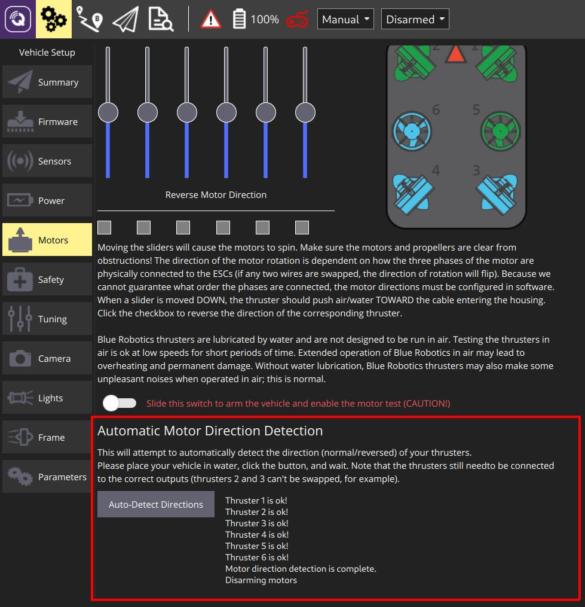

# Motorların Kurulumu (ArduSub)

ArduSub'un düzgün çalışması için motorların doğru şekilde kurulması gerekir.

ROV'nuzu yeni monte ettiyseniz, önce ** Manuel Test ** bölümünde iticilerin doğru çıkışlara bağlandığından emin olun. Her kaydırıcıyı sürükleyin ve görüntülenen ekrana göre * doğru motorun * döndüğünden emin olun.

İticilerinin uygun çıkışlara bağlandığından emin olduktan sonra,* doğru yönü * (ileri / geri) kontrol etmek için [ otomatik yön algılama ](#automatic) (ArduSub 4.0'dan iibaren tavsiye edilir) veya [ manuel test](#manual) seçeneklerinden birini kullanabilirsiniz.

> ** Note ** [ Manuel Test ](#manual) ArduSub tarafından 3.5 sürümüne kadar desteklenirken, ArduSub 4.0 hem [ Manuel Testi ](#manual) hem de [ otomatik yön algılamayı ](#automatic) destekler.

## Manuel Test {#manual}

The ArduSub motor setup allows you to test individual motors. The sliders allow spinning each motor in forward or reverse mode, and the checkboxes under the sliders allow reversing the operation of individual thrusters.

The image at the right shows the frame currently in use, along with the location and orientation of each thruster. If the frame selection does not match your vehicle, first select the correct frame in the [Frame](../SetupView/airframe_ardupilot.md#ardusub) tab.

To manually set up and test the motors, read and follow the instructions on the page.

> **Warning** Make sure the motors and propellers are clear from obstructions before sliding the switch to arm the vehicle and enable the test!

## Automatic Direction Detection {#automatic}

Ardusub 4.0 and newer support automatic detection of the motor directions. This works by applying pulses to each motor, checking if the frame reacts as expected, and reversing the motor if necessary. The process takes around one minute.

To perform the automatic motor direction detection, navigate to **Vehicle Setup->Motors** tab, click the **Auto-Detect Directions** button and wait. Additional output about the process will be shown next to the button as it runs.

> **Warning** This procedure still requires that the motors are connected to the *correct outputs* as shown in the frame view!

