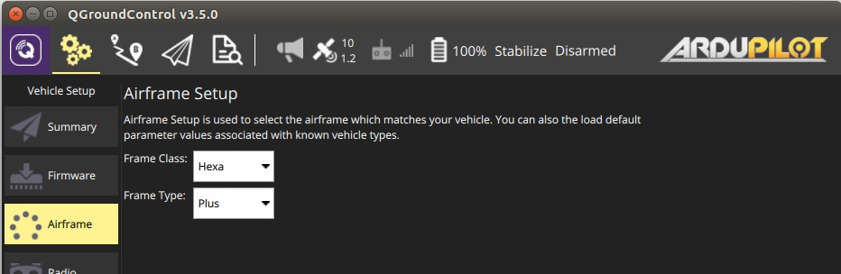
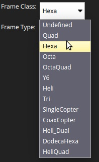
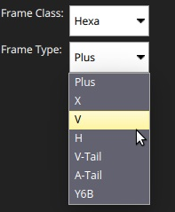

# Gövde Kurulumu (ArduPilot)

Gövde kurulumu, sınıfı ve tipi aracınızla eşleşen gövde seçiminde kullanılır

> **Note** Gövde Kurulumu sadece *ArduCopter* ve *ArduSub* araçları için mevcuttur (*ArduPilot* arazi araçları ya da uçaklar için gösterilmez).

## Arducopter Gövde Kurulumu

Copter'den gövde seçmek için:

1. İlk olarak araç çubuğunun üstündeki **dişli** simgesini (Vechicle Setup), daha sonra kenar çubuğundan **Airframe**'i seçin.
    
    

2. Aracınız için uygun olan *Frame Class* 'ı seçin:
    
    
    
    > **Note** Sınıf değişikliklerinin geçerli olması için aracı yeniden başlatmanız gerekecektir.

3. Aracınız için spesifik *Frame Type* 'ını seçin:
    
    

## ArduSub Gövde Kurulumu {#ardusub}

Sub için gövde tipini seçmek için:

1. İlk olarak araç çubuğunun üstündeki **dişli** simgesini (Vechicle Setup), daha sonra kenar çubuğundan **Frame**'i seçin.
2. Aracınız için uygun olan gövde tipini seçin (bir gövde seçmek, seçimi uygular).
3. Make sure that all **green** thrusters have **clockwise** propellers and all **blue** thrusters have **counter-clockwise** propellers (or vice-versa).
    
    

- You can also click **Load Vehicle Default Parameters** to load default parameter set for ArduSub.
    
    