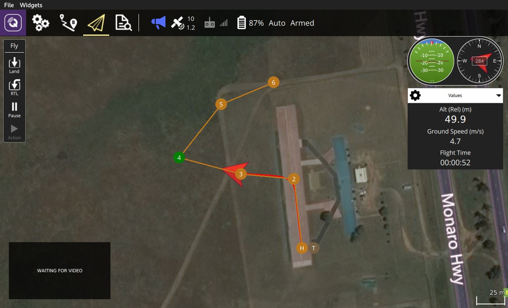
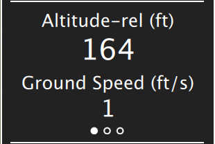

# 飞行数据

飞行数据 界面是你在飞行时要用到的主要界面。 你可以在地图界面或者视频界面（如果视频可用）切换。

## Map

The map will show you the positions of all the vehicles you are connected to. It will also show you the mission for the current vehicle.

## Fly Tools

On the left edge of the screen you will see the Fly Tools. The order of tools from top to bottom is:

* Center map
* Map Type
* Zoom In/Out

### Center Map

The Center Map tool allow you to center the map around various points such as home position, vehicle and so forth.

### Map Type

This tool allows you to change the current map type between Street, Satellite and Hybrid (Street+Satellite). The default map provider is Bing since it seems to provide better Hybrid maps. You can change the map provider from the General page of Settings.

## Video

At the lower left of the display you will see video output. QGroundControl supports RTP and RTSP video streaming over your vehicles UDP connection. It also support directly connected UVC device support. More details on QGC Video support can be found on the [Video README](https://github.com/mavlink/qgroundcontrol/blob/master/src/VideoStreaming/README.md).

By clicking on the video you can make it be the main display for the Fly view.

## Instrument Panel

To the right is an instrument panel showing you current information on your vehicle. The center section of the panel has multiple pages. You can switch between pages by clicking on the center section.

### Telemetry page

The values shown within the telemetry page can be configured by clicking on the small gear icon.

### Vehicle Health page

This page shows you the health of the systems within your Vehicle. If any of the systems switchs from healthy to unhealthy this page will automatically be switched to.

### Vibration Clipping page

This page show you current vibration values and clip counts.

## Guided Bar

At the bottom of the view is the Guided Bar. The guided bar allows to to interact with your vehicle directly from the QGroundControl application. Options available vary by Vehicle and current Vehicle state.

Some of the possible options are:

* Arm, Disarm, Emergency Stop
* Takeoff
* Change altitiude
* Go to location
* 返航
* Pause