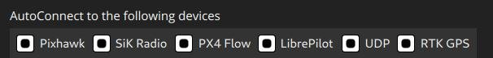
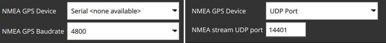
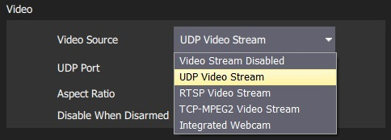

# General Settings (Settings View)

The general settings (**SettingsView > General Settings**) are the main place for application-level configuration. Settable values include: display units, autoconnection devices, video display and storage, RTK GPS, brand image, and other miscellaneous settings.

> **Note** Values are settable even if no vehicle is connected. Settings that require a vehicle restart are indicated in the UI.

## Units

This section defines the display units used in the application.

The settings are:

- **Distance**: Meters | Feet
- **Area**: SquareMetres | SquareFeet | SquareKilometers | Hectares | Acres |SquareMiles
- **Speed**: Metres/second | Feet/second | Miles/hour | Kilometres/hour | Knots
- **Temperature**: Celsius | Fahrenheit

## Miscellaneous

This section defines a number of miscellaneous settings, related to (non exhaustively): font sizes, colour schemes, map providers, map types, telemetry logging, audio output, low battery announcement levels, default mission altitude, [virtual joysticks](../SettingsView/VirtualJoystick.md), mission autoloading, default application file load/save path etc.

The settings are:

- **Color Scheme**: Indoor (Dark) | Outdoor (Light)
- **Map Provider**: Bing | Google | Statkart | Eniro
- **Map Type**: Hybrid | Street | Satellite
- **Stream GCS Position**: Never | Always | When in Follow Me flight mode.
- **Font Size**: Font size across app (Requires restart)
- **Mute all audio output**: Turns off all audio output. 
- **Save telemetry log after each flight**: Logs automatically saved to the *Application Load/Save Path* ([below](#load_save_path)) after flight. 
- **Save telemetry log even if vehicle was not armed**: Logs when a vehicle connects to *QGroundControl*. Stops logging when the last vehicle disconnects.
- **Use preflight checklist**: Enable pre-flight checklist.
- **Virtual Joystick**: Enable [virtual joysticks](../SettingsView/VirtualJoystick.md) (PX4 only)
-  **Autoload Missions**: If enabled, automatically upload a plan to the vehicle on connection. 
  - The plan file must be named **AutoLoad#.plan**, where the `#` is replaced with the vehicle id. 
  - The plan file must be located in the [Application Load/Save Path](#load_save_path).
- **Clear all settings on next start**: Resets all settings to the default (including this one) when *QGroundControl* restarts.
- **Announce battery lower than**: Specify battery level at which *QGroundControl* will start low battery announcements.
- **Default Mission Altitude**: The default altitude used for the first waypoint (subsequent new waypoints are seeded with the altitude value of the preceding waypoint).
- **Application Load/Save Path**: Default location for loading/saving application files, including: parameters, telemetry logs, and mission plans.

## RTK GPS

This section specifies the RTK GPS "Survey-in" settings.

> **Note** The *Survey-In* process is a startup procedure required by RTK GPS systems to get an accurate estimate of the base station position. The process takes measurements over time, leading to increasing position accuracy. Both of the setting conditions must met for the Survey-in process to complete. For more information see [RTK GPS](https://docs.px4.io/en/advanced_features/rtk-gps.html) (PX4 docs) and [GPS- How it works](http://ardupilot.org/copter/docs/common-gps-how-it-works.html#rtk-corrections) (ArduPilot docs).

The settings are:

- **Survey-in accuracy:** The minimum position accuracy for the RTK Survey-in process to complete.
- **Minimum observation duration:** The minimum time that will be taken for the RTK Survey-in process. 

## AutoConnect to the following devices {#auto_connect}

This section defines the set of devices to which *QGroundControl* will auto-connect.

Settings include:

- **Pixhawk**: Autoconnect to Pixhawk-series device
- **SiK Radio**: Autoconnect to SiK (Telemetry) radio
- **PX4 Flow**: Autoconnect to PX4Flow device
- **Libre Pilot**: Autoconnect to Libre Pilot autopilot
- **UDP**: Autoconnect to UDP
- **RTK GPS**: Autoconnect to RTK GPS device

## Ground Station GPS (NMEA GPS Device) {#nmea_gps}

The Ground Station GPS section is used to choose the source of GPS data that will be used for the GCS location. When there is a valid position provided by the NMEA GPS device, the location of the ground control station will be displayed on the map with a purple `Q` icon. If the GPS provides a heading, it will be indicated by the `Q` icon. The GCS location is also used to provide follow me support ([follow me](https://docs.px4.io/en/flight_modes/follow_me.html) is currently implemented for PX4 only).

You can change the GPS source using the drop down menu in the NMEA GPS Device field. The configuration options will change based on the selected device (as shown below).

Three sources of GPS positioning for the ground control station are supported:

1. **Internal GPS unit:** Many mobile devices have GPS built in. If your device internal GPS is supported, it will be automatically detected and used to display the ground control station position.
2. **USB GPS unit:** If your device does not have a built in GPS, you may select to use a USB (serial) GPS. The GPS must print ASCII NMEA format (this is normally the case). The serial (COM) port and baudrate for the USB GPS must be configured by the user (see below). If you have trouble with using a USB GPS for positioning, try to disable RTK GPS [auto connection](#auto_connect), close qgc, reconnect your GPS, and open QGC.
3. **Networked GPS:** If you are using your USB GPS for another application, or you have some other GPS system that is not supported by the other options, you may use a UDP network port to send the GPS data to QGC. The network port for QGC to bind and listen for data must be configured by the user (see below). The data format sent to the UDP port should be in raw ASCII NMEA format.

Use these menu items to configure a USB or UDP GPS:

- **NMEA GPS Device**: Select serial or UDP port for GPS information
- **NMEA GPS Baudrate**: If serial port is selected, this sets the baudrate for that port
- **NMEA Stream UDP Port**: If UDP port is selected, this is used to select the port that QGC will listen for the NMEA data (QGC binds the port as a server)

## Video {#video}

The *Video* section is used to define the source and connection settings for video that will be displayed in *Fly View*.

> **Note** The values displayed in this setting depend on the video source. If no video source is specified then no other video or *video recording* settings will be displayed (above we see the settings when UDP source is selected).

## Video Recording

The *Video Recording* section is used to specify the file format and maximum allocated file storage for storing video. Videos are saved to a sub-directory ("Video") of the [Application Load/Save Path](#load_save_path).

The settings are:

- **Auto-delete Files**: If checked, files are auto deleted when the specified amount of storage is used.
- **Max Storage Usage**: Maximum video file storage before video files are auto deleted.
- **Video file format**: File format for the saved video recording.

## Brand Image

This setting specifies the *brand image* used for indoor/outdoor colour schemes.

The brand image is displayed in place of the icon for the connected autopilot in the top right corner of the toolbar. It is provided so that users can easily create screen/video captures that include a company logo/branding.

The settings are:

- **Indoor Image**: Brand image used in [indoor color scheme](#colour_scheme)
- **Outdoor Image**: Brand image used in [outdoor color scheme](#colour_scheme)
- **Reset Default Brand Image**: Reset the brand image back to default.