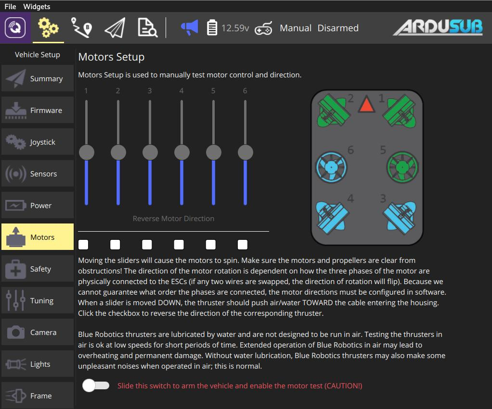

# Motors Setup (ArduSub)

The ArduSub motor setup allows you to test individual motors. The sliders allow spinning each motor in forward or reverse mode, and the checkboxes under the sliders allow reversing the operation of individual thrusters.

The image at the right shows the frame currently in use, along with the location and orientation of each thruster. If the frame selection does not match your vehicle, first select the correct frame in the [Frame](../SetupView/airframe_ardupilot.md#ardusub) tab.

To set up and test the motors, read and follow the instructions on the page.

> **Warning** Make sure the motors and propellers are clear from obstructions before sliding the switch to arm the vehicle and enable the test!

