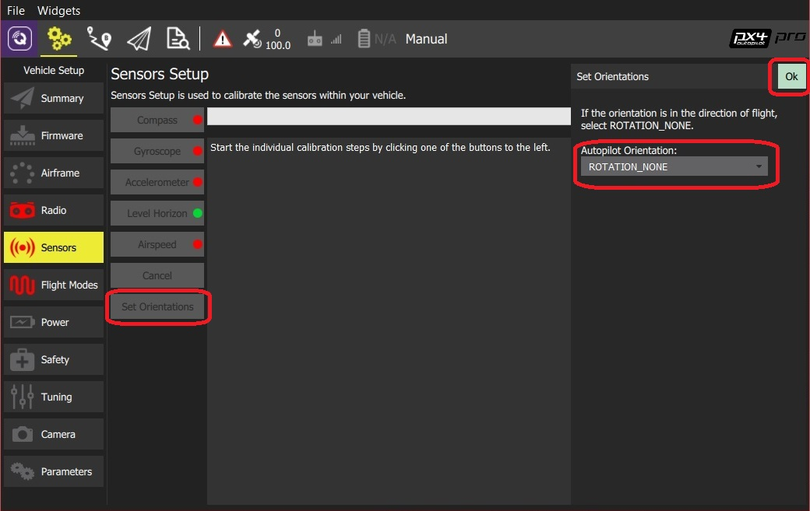
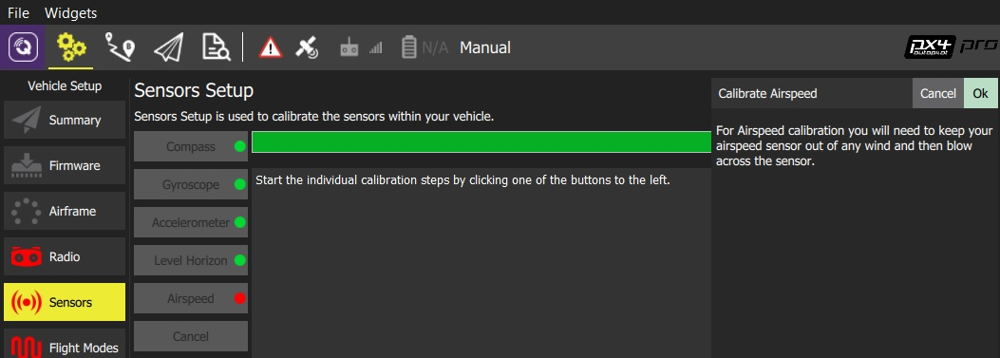

# Sensors

The *Sensor Setup* section allows you to configure and calibrate the vehicle's compass, gyroscope, accelerometer and other sensors (if present).

Available sensors are displayed as a list of buttons beside the sidebar. Sensors marked with green are already calibrated. Sensors marked with red require calibration prior to flight.

> **Note** The image shown is from a VTOL vehicle running PX4 firmware. Other autopilot firmware and vehicles will offer slightly different options.

Click on the button for each sensor to start its calibration sequence.

## Flight Controller Orientation {#flight_controller_orientation}

> **Tip** You can skip this section if the flight controller and compass are mounted upright on the vehicle and facing the front (this is the default orientation - `ROTATION_NONE`).

If the autopilot/compass are mounted in any other way you will need to specify their orientations as YAW, PITCH and/or ROLL offsets relative to the forward-facing-upright orientation (clock-wise rotation around the Z, Y and X axis, respectively).

For example, the image below are at orientations: `ROTATION_NONE`, `ROTATION_YAW_90`,`ROTATION_YAW_180`,`ROTATION_YAW_270`.

### Set Orientations (PX4)

To set the orientation(s) on PX4:

1. Select the **Set Orientations** button.
    
    

2. Select the **AutoPilot Orientation**.

3. Select the **External Compass Orientation** (this option will only be displayed if there is an external compass).
4. Press **OK**.

### Sensor Settings (ArduPilot)

To set the orientation(s) on ArduPilot:

1. Select the **Sensor Settings** button.
    
    

2. Select the **AutoPilot Orientation**.

3. Select the *orientation* from **Compass 1 (primary/external) > Orientation** (or check **Compass2 (secondary, external) > Use Compass** to instead use the internal compass).
4. Press **OK**.

## Compass

### PX4 Compass Calibration

For PX4 you will be guided to position the vehicle in a number of set orientations and rotate the vehicle about the specified axis.

> **Note** This process is also used for calibrating the compass on older ArduPilot firmware.

The calibration steps are:

1. Click the **Compass** sensor button  > **Note** You should already have set the [Flight Controller Orientation](#flight_controller_orientation) above. If not, you can also set it here.
2. Click **OK** to start the calibration. 
3. Place the vehicle in any of the orientations shown in red (incomplete) and hold it still. Once prompted (the orientation-image turns yellow) rotate the vehicle around the specified axis in either/both directions. Once the calibration is complete in that orientation the associated image on the screen will turn green. 
4. Repeat the calibration process for all vehicle orientations.

Once you've rotated the vehicle in all the positions *QGroundControl* will display *Calibration complete* (all orientation images will be displayed in green and the progress bar will fill completely). You can then proceed to the next sensor.

### ArduPilot Compass Calibration

ArduPilot uses onboard calibration support that allows for more accurate calibration.

> **Note** Older ArduPilot firmware can be calibrated using the same process as PX4.

You need to rotate the vehicle randomly around all axes until the progress bar fills all the way to the right and the calibration completes. When the calibration completes you will get the following results:

This shows you the quality of the calibration for each compass. Using these values you can determine whether you may want to turn off usage of poorly performing compasses.

## Accelerometer

To calibrate the flight controller accelerometers you will be asked to place and hold your vehicle a number of orientations (you will be prompted when to move between positions). The screens are different for PX4 and ArduPilot.

### PX4 Accelerometer Calibration

The calibration steps are:

1. Click the **Accelerometer** sensor button.  > **Note** You should already have set the [Flight Controller Orientation](#flight_controller_orientation) above. If not, you can also set it here. 
2. Click **OK** to start the calibration. 
3. Position the vehicle as guided by the *images* on the screen. This is very similar to compass calibration. 

### ArduPilot Accelerometer Calibration

The calibration steps are:

1. Click the **Accelerometer** sensor button.  > **Note** You should already have set the [Flight Controller Orientation](#flight_controller_orientation) above. If not, you can also set it here. 
2. Click **OK** to start the calibration. 
3. Position the vehicle based on text instructions in the center display. Click the **Next** button to capture each position. 

## Level Horizon

If the horizon (as shown in the HUD) is not level after completing Accelerometer calibration you can calibrate the level horizon for your vehicle. You will be asked to place the vehicle in a level orientation while it captures the information.

1. Click the **Level Horizon** sensor button.  > **Note** You should already have set the [Flight Controller Orientation](#flight_controller_orientation) above. If not, you can also set it here. 
2. Place the vehicle in its level flight orientation on a level surface: 
    - For planes this is the position during level flight (planes tend to have their wings slightly pitched up!)
    - For copters this is the hover position.
3. Click **OK** to start the calibration. 

## Airspeed

The airspeed calibration needs to read a stable baseline with 0 airspeed in order to determine an offset. Cup your hands over the pitot to block any wind (if calibrating the sensor indoors this is not needed) and then blow into the tube using your mouth (to signal completion of the calibration).

To calibrate the airspeed sensor:

1. Click the **Airspeed** sensor button
    
    

2. Cover the sensor (i.e. with your hand)
    
    > **Warning** Do not touch the sensor (obstruct any holes) during calibration.

3. Click **OK** to start the calibration.

4. Blow into the sensor.
5. Wait for 2-3 seconds before removing the covering (calibration completes silently after several seconds)

## CompassMot (Optional - ArduPilot only)

CompassMot calibration is optional! It is recommended for vehicles that only have an internal compass and where there is significant interference on the compass from the motors, power wires, etc. CompassMot only works well if you have a battery current monitor because the magnetic interference is linear with current drawn.

To perform **CompassMot** calibration:

1. Click the **CompassMot** sensor button.
    
    

2. Follow the onscreen prompts.
    
    