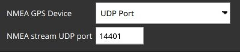

# Daily Build Major Changes

This topic contains a high level and *non-exhaustive* list of new features added to *QGroundControl* since the last [stable release](../releases/release_notes.md). These features are available in [daily builds](../releases/daily_builds.md).

## Plan

### Simple Terrain Support

Allows you to create mission items which specify altitude as height above terrain: [Details](https://github.com/mavlink/qgroundcontrol/pull/6225)

## Settings

### UDP Option for Groundstation GPS

Allows you to feed the GPS position (NMEA Stream) to QGC via an UDP port: [Details](https://github.com/mavlink/qgroundcontrol/pull/7114)